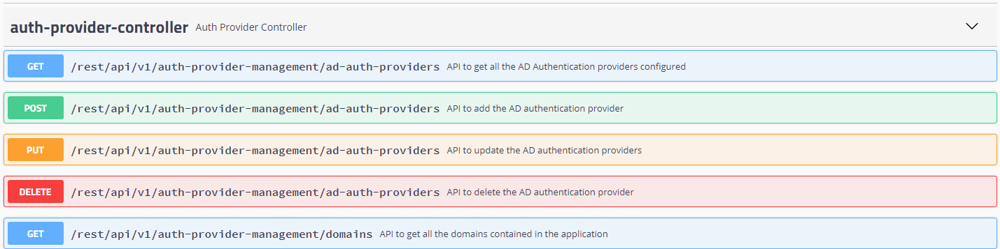
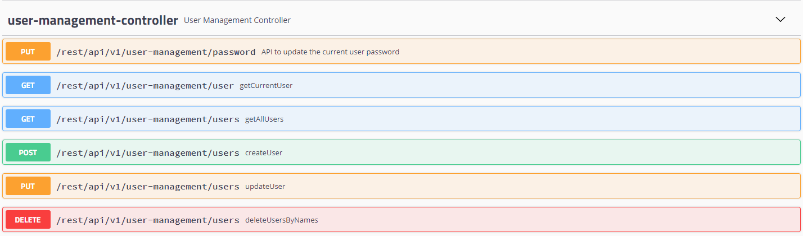
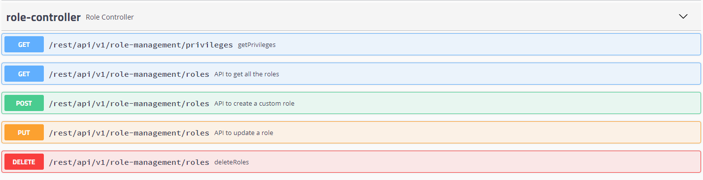

# Admin Settings

## Managing Authentication

### Adding additional Authentication sources

Mangle supports using Active Directory as an additional authentication source.

**Steps to follow:**

1. Login as an admin user to Mangle.
2. Navigate to  -----&gt; Auth Management  -----&gt; Auth Source .
3. Click on .
4. Enter URL, Domain and click on **Submit**.
5. A success message is displayed and the table for Auth sources will be updated with the new entry.
6. Click on  against a table entry to see the supported operations.


**Relevant API List**

**For access to Swagger documentation, please traverse to link**  -----&gt; API Documentation from the Mangle UI or access [https://&lt;Mangle](https://<Mangle) _IP or Hostname&gt;/mangle-services/swagger-ui.html\#/auth-provider-controller_



### Adding/Importing Users

Mangle supports adding new local user or importing users from Active Directory sources added as additional authentication sources.

**Steps to follow:**

1. Login as an admin user to Mangle.
2. Navigate to  -----&gt; Auth Management  -----&gt; Users .
3. Click on .
4. Enter User Name, Auth Source, Password if the Auth Source selected is "mangle.local", an appropriate role and click on **Submit**.
5. A success message is displayed and the table for Users will be updated with the new entry.
6. Click on  against a table entry to see the supported operations.


**Relevant API List**

**For access to Swagger documentation, please traverse to link**  -----&gt; API Documentation from the Mangle UI or access [https://&lt;Mangle](https://<Mangle) _IP or Hostname&gt;/mangle-services/swagger-ui.html\#/user-management-controller_



### Default and Custom Roles

Mangle has the following default Roles and Privileges.

| Default Role | Default Privileges | Allowed Operations |
| :--- | :--- | :--- |
| ROLE\_READONLY | READONLY |  |
| ROLE\_ADMIN | ADMIN\_READ\_WRITE, USER\_READ\_WRITE |  |
| ROLE\_USER | ADMIN\_READ, USER\_READ\_WRITE |  |


Edit and Delete operations are supported only for custom roles. It is forbidden for default roles.


Mangle supports creation of custom roles from the default privileges that are available.

**Steps to follow:**

1. Login as an admin user to Mangle.
2. Navigate to  -----&gt; Auth Management  -----&gt; Roles.
3. Click on .
4. Enter Role Name, Privileges and click on **Submit**.
5. A success message is displayed and the table for Roles will be updated with the new entry.
6. Click on  against a table entry to see the supported operations.


**Relevant API List**

**For access to Swagger documentation, please traverse to link**  -----&gt; API Documentation from the Mangle UI or access [https://&lt;Mangle](https://<Mangle) _IP or Hostname&gt;/mangle-services/swagger-ui.html\#/role-controller_



## Loggers

### Log Levels

Mangle supports modifying log levels for the application.

**Steps to follow:**

1. Login as an admin user to Mangle.
2. Navigate to  -----&gt; Loggers  -----&gt; Log Levels .
3. Click on .
4. Enter Logger name, Configured Level, Effective Level and click on **Submit**.
5. A success message is displayed and the table for Log levels will be updated with the new entry.
6. Click on  against a table entry to see the supported operations.


**Relevant API List**

**For access to Swagger documentation, please traverse to link**  -----&gt; API Documentation from the Mangle UI or access [https://&lt;Mangle](https://<Mangle) _IP or Hostname&gt;/mangle-services/swagger-ui.html\#/operation-handler_



## Integrations

### Metric Providers

Mangle supports addition of either Wavefront or Datadog as metric providers. This enables the information about fault injection and remediation to be published to these tools as events thus making it easier to monitor them.

**Steps to follow:**

1. Login as an admin user to Mangle.
2. Navigate to  -----&gt; Integrations  -----&gt; Metric Providers .
3. Click on .
4. Choose Wavefront or Datadog, provide credentials and click on **Submit**.
5. A success message is displayed and the table for Monitoring tools will be updated with the new entry.
6. Click on  against a table entry to see the supported operations.

On adding a metric provider, Mangle will send events automatically to the enabled provider for every fault injected and remediated. If the requirement is to monitor Mangle as an application by looking at its metrics, then click on the  button to enable sending of Mangle application metrics to the corresponding metric provider.


**Relevant API List**

**For access to Swagger documentation, please traverse to link**  -----&gt; API Documentation from the Mangle UI or access [https://&lt;Mangle](https://<Mangle) _IP or Hostname&gt;/mangle-services/swagger-ui.html\#_/operation-handler



