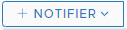

# Admin Settings

## Managing Authentication

#### Adding additional Authentication sources

Mangle supports using Active Directory as an additional authentication source.&#x20;

**Steps to follow:**&#x20;

1. Login as an admin user to Mangle.
2. Navigate to  -----> Auth Management  -----> Auth Source .
3. Click on .
4. Enter URL, Domain and click on **Submit**.
5. A success message is displayed and the table for Auth sources will be updated with the new entry.
6. Click on  (3).png>) against a table entry to see the supported operations.


**Relevant API List**

**For access to Swagger documentation, please traverse to link**  -----> API Documentation from the Mangle UI or access _https://\<Mangle IP or Hostname>/mangle-services/swagger-ui.html#/auth-provider-controller_&#x20;


#### Adding/Importing Users

Mangle supports adding new local user or importing users from Active Directory sources added as additional authentication sources.&#x20;

**Steps to follow:**&#x20;

1. Login as an admin user to Mangle.
2. Navigate to  -----> Auth Management  -----> Users .
3. Click on .
4. Enter User Name, Auth Source, Password if the Auth Source selected is "mangle.local", an appropriate role and click on **Submit**.
5. A success message is displayed and the table for Users will be updated with the new entry.
6. Click on  (3).png>) against a table entry to see the supported operations.


**Relevant API List**

**For access to Swagger documentation, please traverse to link**  -----> API Documentation from the Mangle UI or access _https://\<Mangle IP or Hostname>/mangle-services/swagger-ui.html#/user-management-controller_&#x20;


#### Default and Custom Roles

Mangle has the following default Roles and Privileges.

| Default Role   | Default Privileges                    | Allowed Operations                                                                                                                                      |
| -------------- | ------------------------------------- | ------------------------------------------------------------------------------------------------------------------------------------------------------- |
| ROLE\_READONLY | READONLY                              | Read Access to all endpoints, faults, requests, resiliency score queries and  services. No access to Admin settings or events.                          |
| ROLE\_ADMIN    | ADMIN\_READ\_WRITE, USER\_READ\_WRITE | Access to all features and Admin settings                                                                                                               |
| ROLE\_USER     | ADMIN\_READ, USER\_READ\_WRITE        | Add, Edit, Delete and Run privileges to all endpoints, faults, requests, resiliency score queries and  services. No access to Admin settings or events. |

Mangle supports creation of custom roles from the default privileges that are available.&#x20;

**Steps to follow:**&#x20;

1. Login as an admin user to Mangle.
2. Navigate to  -----> Auth Management  -----> Roles.
3. Click on .
4. Enter Role Name, Privileges and click on **Submit**.
5. A success message is displayed and the table for Roles will be updated with the new entry.
6. Click on  (3).png>) against a table entry to see the supported operations.


**Relevant API List**

**For access to Swagger documentation, please traverse to link**  -----> API Documentation from the Mangle UI or access _https://\<Mangle IP or Hostname>/mangle-services/swagger-ui.html#/role-controller_&#x20;


## Configuration

### Logging

#### Log Levels

Mangle supports modifying log levels for the application.&#x20;

**Steps to follow:**&#x20;

1. Login as an admin user to Mangle.
2. Navigate to  -----> Configuration -----> Logging .
3. Click on .
4. Enter Logger name, Configured Level, Effective Level and click on **Submit**.
5. A success message is displayed and the table for Log levels will be updated with the new entry.
6. Click on  (3).png>) against a table entry to see the supported operations.

 Clicking on  will open up the log on the UI and will be auto refreshed periodically.

 Clicking on  will allow you to download and save the support bundle from the mangle server to a local file directory. In case of a clustered Mangle setup, the action should be repeated for each node in the cluster to get the support bundle from all nodes.


**Relevant API List**

**For access to Swagger documentation, please traverse to link**  -----> API Documentation from the Mangle UI or access _https://\<Mangle IP or Hostname>/mangle-services/swagger-ui.html#/operation-handler_


###  Cluster Config

The cluster config section provides details about the Mangle deployment mode and the various nodes that form the setup in case of a clustered deployment of Mangle. You can modify the quorum settings and switch between deployment types through the UI.

**Steps to follow:**&#x20;

1. Login as an admin user to Mangle.
2. Navigate to  -----> Configuration -----> Cluster Config.

The page displays the cluster name, the validation token, members, quorum and deployment mode in a tabular format. Quorum and deployment mode can be edited through the UI.


**Relevant API List**

**For access to Swagger documentation, please traverse to link**  -----> API Documentation from the Mangle UI or access _https://\<Mangle IP or Hostname>/mangle-services/swagger-ui.html#/cluster-config-controller_


### Fault Plugins

This section enables you to load custom faults that are already available on the [Mangle Github repo](https://github.com/vmware/mangle/tree/master/mangle-custom-plugins) or a new one that you have created using the steps mentioned in the [Custom Faults](../sre-developers-and-users/injecting-faults/custom-faults.md#mangle-custom-fault-development) section of the Users Guide, to an existing running instance of Mangle.

**Steps to follow:**&#x20;

1. Login as an admin user to Mangle.
2. Navigate to  -----> Configuration -----> Fault Plugins.
3. Click on .
4. Choose the plugin zip file that was created after following the steps mentioned in the [Custom Faults](../sre-developers-and-users/injecting-faults/custom-faults.md#mangle-custom-fault-development) section of the Users Guide.
5. Click **Submit**.
6. A success message is displayed and the table for Plugins will be updated with the new entry.
7. Click on  (3).png>) against a table entry to see the supported operations.


**Relevant API List**

**For access to Swagger documentation, please traverse to link**  -----> API Documentation from the Mangle UI or access _https://\<Mangle IP or Hostname>/mangle-services/swagger-ui.html#/plugin-controller_


###  Resiliency Score Metric Configuration

Resiliency Score is a compelling new feature that enables you to quantify the resiliency or fault tolerance capacity of the application or system under test. The score is calculated by retrieving application metrics of your choice from the monitoring tool that you use, during fault injection. The score is then pushed back to the monitoring tool as a metric that can be monitored and tracked over a period of time.

The configuration required to enable resiliency score calculations has to be done through Admin settings.

**Steps to follow:**&#x20;

1. Login as an admin user to Mangle.
2. Navigate to  -----> Configuration -----> Resiliency Score Metric Configuration.
3. Click on .png>).
4. Provide the following inputs:
   1. A name for the configuration
   2. Metric Name - Resiliency score metrics will be stored in the monitoring tool using this name _for eg: mangle.resiliency.score_),&#x20;
   3. A metric source name - The source can be used to filter resiliency score metrics easily on the monitoring tool.
   4. Test Reference Window - This refers to the time window before and after a fault injection event which will serve as a reference for the state of the system before and after the test. This value should be specified in minutes.
   5. Calculation Window - Mangle will retrieve the time series data from the monitoring system as per the calculation window configured. This value should be specified in hours.
   6. Granularity of the time series data - This is to determine the granularity of the data retrieved from the monitoring system. In can be in seconds, minutes, hours and days.
5. Click **Submit**.
6. A success message is displayed and the table for Resiliency Metric Configuration will be updated with the new entry.
7. Click on  (3).png>) against a table entry to see the supported operations.


**PLEASE NOTE:**

_Only one configuration for the resiliency score calculation can be created._

_This feature is still under evaluation and is supported only **VMware Wavefront**. If you need Mangle to provide support for other monitoring systems, please raise a feature request under_ [_Mangle Github_](https://github.com/vmware/mangle/issues)_._



**Relevant API List**

**For access to Swagger documentation, please traverse to link**  -----> API Documentation from the Mangle UI or access _https://\<Mangle IP or Hostname>/mangle-services/swagger-ui.html#/resiliency-score-controller_


## Integrations

### Metric Providers

Mangle supports addition of Wavefront, Datadog or Dynatrace as metric providers. This enables the information about fault injection and remediation to be published to these tools as events thus making it easier to monitor them.&#x20;

**Steps to follow:**&#x20;

1. Login as an admin user to Mangle.
2. Navigate to  -----> Integrations  -----> Metric Providers .
3. Click on .
4. Choose Wavefront, Datadog or Dynatrace, provide credentials and click on **Submit**.
5. A success message is displayed and the table for Monitoring tools will be updated with the new entry.
6. Click on  (3).png>) against a table entry to see the supported operations.

On adding a metric provider, Mangle will send events automatically to the enabled provider for every fault injected and remediated. If the requirement is to monitor Mangle as an application by looking at its metrics, then click on the  button to enable sending of Mangle application metrics to the corresponding metric provider.


**Notes about the Dynatrace Integration:**

Device ID: The name of the custom device that will appear in the user interface of Dynatrace. The custom device will be created at Dynatrace only on enabling to "Send Metric" option at Mangle. Application metrics of Mangle will be visible under the specified device ID at Dynatrace on enabling "Send Metric" option at Mangle.

Dynatrace expects same dimensions for the metrics reported by an application. Hence, if you have multiple Mangle instance deployments then , please include the same "key" under "tags" option (values can be different) while configuring the Mangle metric provider.




**Relevant API List**

**For access to Swagger documentation, please traverse to link**  -----> API Documentation from the Mangle UI or access _https://\<Mangle IP or Hostname>/mangle-services/swagger-ui.html#_/_operation-handler_


### __ Notifier

Mangle supports Slack as a notifier while faults are injected to endpoints.&#x20;

**Steps to follow:**&#x20;

1. Login as an admin user to Mangle.
2. Navigate to  -----> Integrations  -----> Notifier .
3. Click on .
4. Provide a Name, Slack OAuth Token and the appropriate channel names to post to.
5. Test the connection and click on **Submit**.
6. A success message is displayed and the table for Notifiers will be updated with the new entry.
7. Edit and Delete options are supported .

After this configuration, you will be able to select an appropriate notifier at the time of fault execution. When a fault is injected into the appropriate endpoint a notification similar to the one below will be posted to Slack.

&#x20;&#x20;


**Relevant API List**

**For access to Swagger documentation, please traverse to link**  -----> API Documentation from the Mangle UI or access _https://\<Mangle IP or Hostname>/mangle-services/swagger-ui.html#/notifier-controller_

