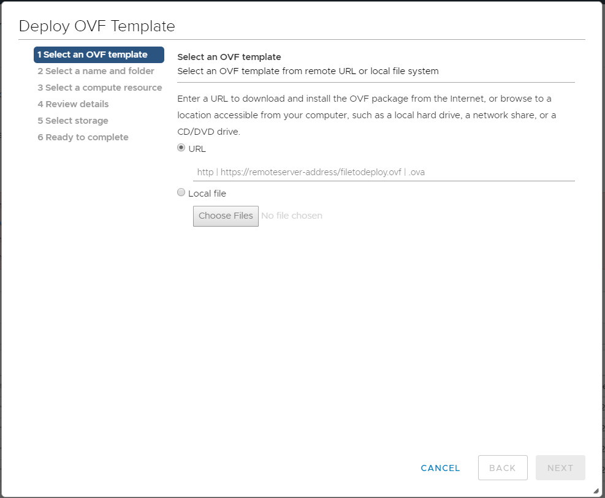
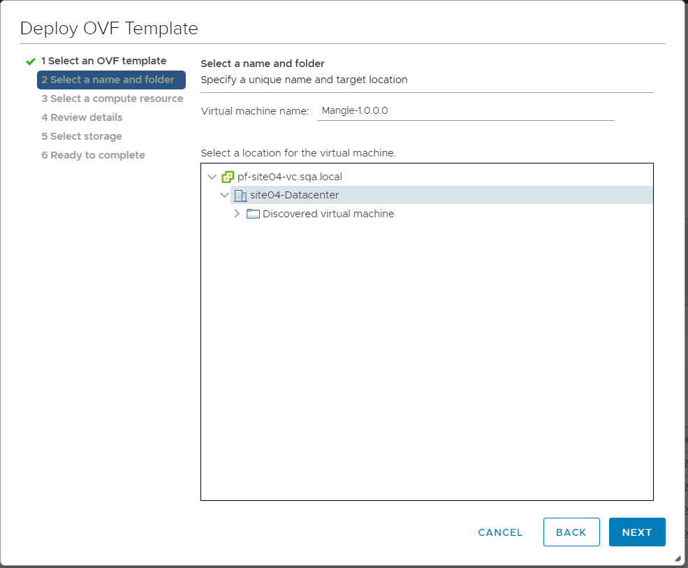
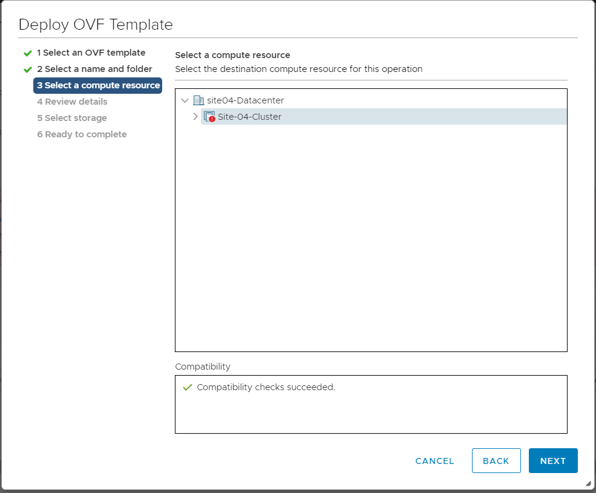
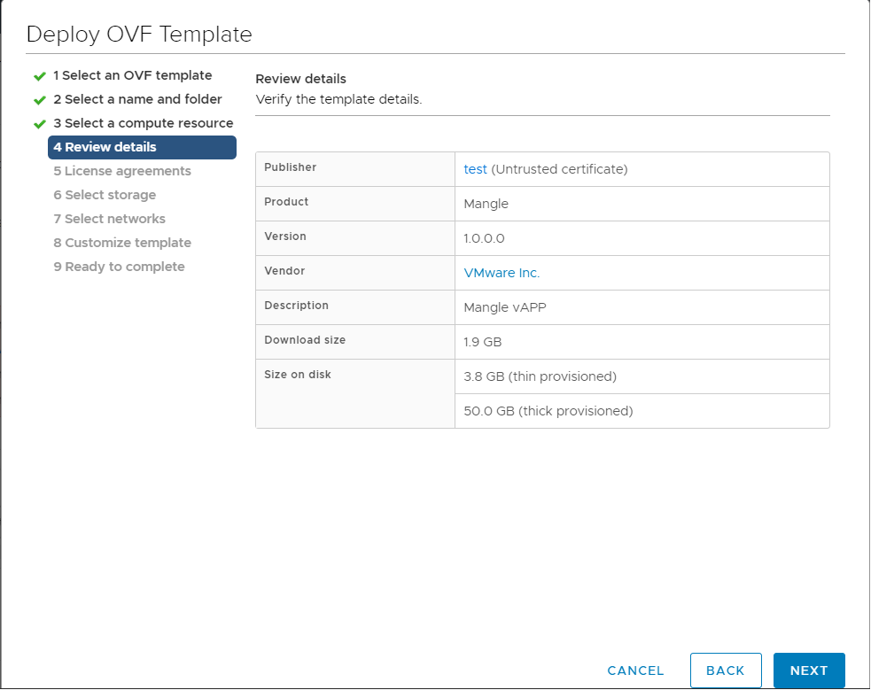
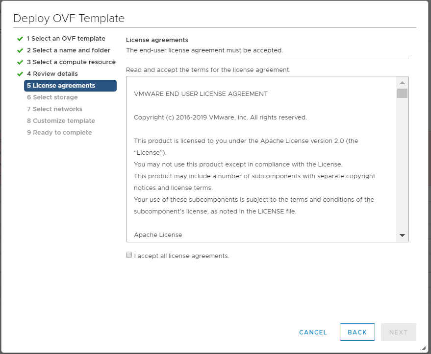
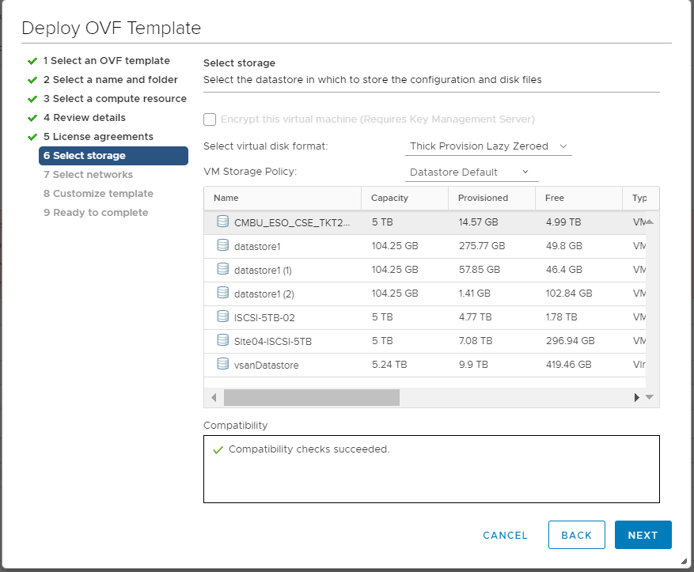
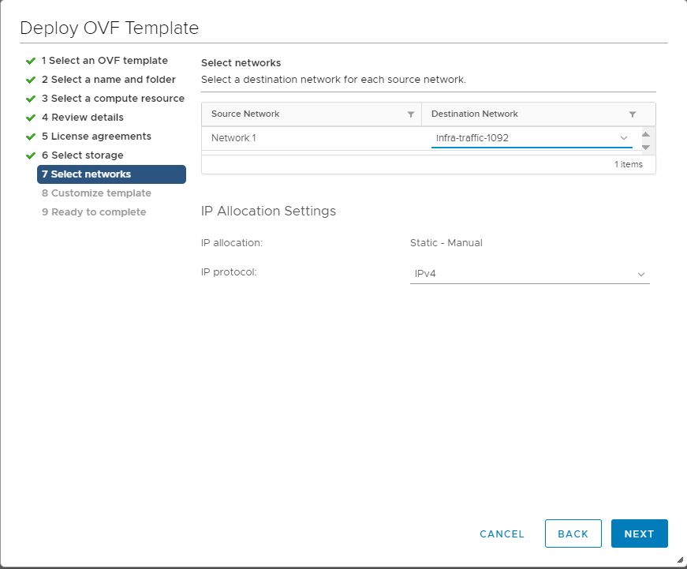
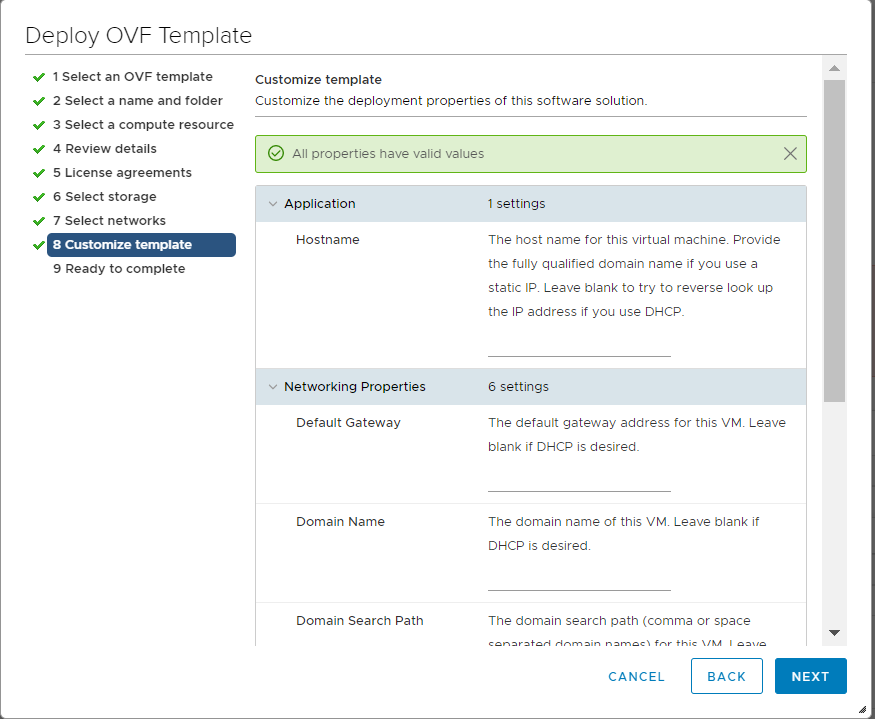

# Supported Deployment Models

## Single Node Deployments

### Deploying the Mangle Virtual Appliance

For a quick POC we recommend that you deploy a single node instance of Mangle using the OVA file that we have made available [here](https://dl.bintray.com/vmware/photon/3.0/GA/ova/photon-hw11-3.0-26156e2.ova).

Using the OVA is a fast and easy way to create a Mangle VM on VMware vSphere.

After you have downloaded the OVA, log in to your vSphere environment and perform the following steps:

1. Start the Import Process

   From the Actions pull-down menu for a datacenter, choose **Deploy OVF Template**.

   

   Provide the location of the downloaded ova file.

   Choose **Next**.

2. Specify the name and location of virtual machine                      Enter a name for the virtual machine and select a location for the virtual machine.

   

   Choose **Next**.

3. Specify the compute resource

   Select a cluster, host or resource pool where the virtual machine needs to be deployed.

   

   Choose **Next**.

4. Review details

    

   Choose **Next**.

5. Accept License Agreement

   Read through the Mangle License Agreement, and then choose **I accept all license agreements**.

   

   Choose **Next**.

6. Select Storage

   Mangle is provisioned with a maximum disk size. By default, Mangle uses only the portion of disk space that it needs, usually much less that the entire disk size \( **Thin** client\). If you want to pre-allocate the entire disk size \(reserving it entirely for Mangle instead\), select **Thick** instead.

   

   Choose **Next**.

7. Select Network

   Provide a static or dhcp IP for Mangle after choosing an appropriate destination network.  

    

   Choose **Next**.

8. Verify Deployment Settings and click **Finish** to start creating the virtual machine. Depending on bandwidth, this operation might take a while. When finished, vSphere powers up the Mangle VM based on your selections.

After the VM is booted, open the command window. vSphere prompts you to log in.

**Note**: Because of limitations within OVA support on vSphere, it was necessary to specify a default password for the OVA option. However, all Mangle instances that are created by importing the OVA require an immediate password change upon login. The default account credentials are:

* Username: `root`
* Password: `changeme`

  After you provide these credentials, vSphere prompts you to create a new password and type it a second time to verify it.

  **Note:** For security, Mangle forbids common dictionary words for the root password.

  Once logged in, you will see the shell prompt.

* The Mangle application should be available at the following URL: _https://&lt;IP or Hostname provided&gt;/mangle-services_
* You will be prompted to change the admin password to continue.
  * Default Mangle Username: `admin@mangle.local`
  * Password: `admin`

Export the VM as a Template \(Optional\)

Consider converting this imported VM into a template \(from the Actions menu, choose **Export** \) so that you have a master Mangle instance that can be combined with vSphere Guest Customization to enable rapid provisioning of Mangle instances.

### Deploying the Mangle Containers

#### Prerequisites

Before creating the Mangle container a Cassandra DB container should be made available on a Docker host. You can setup a docker host by following the instructions [here](https://docs.docker.com/install/).

To deploy a Cassandra DB container without enabling authentication or ssl run the docker command below on the docker host.

```text
docker run --name mangle-cassandra -v /cassandra/storage/:/var/lib/cassandra -p 9042:9042 -d -e CASSANDRA_CLUSTER_NAME="manglecassandracluster" -e CASSANDRA_DC="DC1" -e CASSANDRA_RACK="rack1" -e CASSANDRA_ENDPOINT_SNITCH="GossipingPropertyFileSnitch"  cassandra:3.11
```

To enable authentication or clustering on Cassandra refer to the [Cassandra Advanced Configuration](advanced-cassandra-configuration.md).

To deploy the Mangle container run the docker command below on the docker host.

```text
docker run --name mangle -d -e DB_OPTIONS="-DcassandraContactPoints=$(docker inspect --format '{{ .NetworkSettings.IPAddress }}' mangle-cassandra) -DcassandraUsername= -DcassandraSslEnabled=false" -e CLUSTER_OPTIONS="-DhazelcastValidationToken=mangle" -p 8080:8080 -p 8443:8443 https://vmware.bintray.com/mangle:$MANGLE_BUILD
```

## Multi Node Deployment


