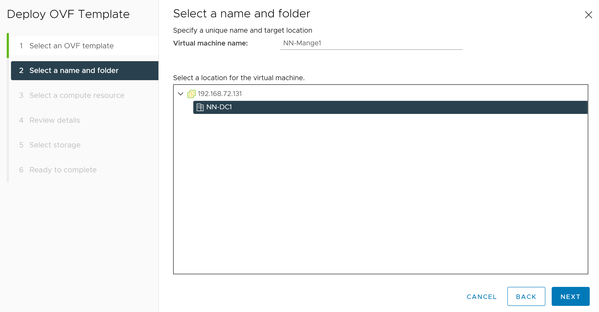

# Supported Deployment Models

## Single Node Deployments

For a quick POC we recommend deploying a single node instance of Mangle on VMware vSphere using the OVA file available for download [here](https://repo.vmware.com/mangle/v3.0.0/Mangle-3.0.0.0_OVF10.ova). 

### System Requirements

A single node instance of the Mangle virtual appliance will be provisioned with the following resources:
* 4 vCPU
* 8 GB RAM
* Approximately 54 GB of storage space (if thick provisioned)
* Hosts running ESXi version 5.5 or later

### Deploying the Mangle Virtual Appliance

Login to your vSphere environment and perform the following steps in vCenter:

1. Start the Import Process

   * From the Actions pull-down menu for a datacenter, choose **Deploy OVF Template**.
   

   * Locate and select the downloaded OVA file (as the screenshot shows), or alternatively, for vCenter instances with connectivity to the internet, enter the OVA's URL to deploy from the web directly.

   * Choose **Next**.

2. Specify the Name and Location of Virtual Machine                      

   * Enter a name for the virtual machine, and select the target location for it.
   

   * Choose **Next**.

3. Specify the Compute Resource

   * Select a cluster, host or resource pool where the virtual machine will be deployed.
   

   * Choose **Next**.

4. Review Details

   * This screen shows details of the virtual appliance, including download size and size on disk.
    

   * Choose **Next**.

5. Accept License Agreement

   * Read through the Mangle License Agreement, and then choose **I accept all license agreements**.
   

  * Choose **Next**.

6. Select Storage

   * Mangle is provisioned with a maximum disk size. By default, Mangle uses only the portion of disk space that it needs, usually much less than the entire disk size \(**Thin** provisioned\). If you want to pre-allocate the entire disk size \(reserving it entirely for Mangle instead\), select **Thick** provisioning.
   

   * Choose **Next**.

7. Select Network

   * Choose an appropriate virtual network for the appliance and the IP protocol you will use (IPv4 by default but supports IPv6). 
    

   * Choose **Next**.

8. Customize the Template

   * Enter a root user password for the Mangle appliance.  You should memorize this password to access the Mangle VM via SSH or console post deployment.
    
   
   * Once the password has been entered and confirmed, you will see a success message stating **All properties have valid values.**
    

   * Enter values for any Networking Properties that need to be specified.  If any field is left blank, DHCP will be used.
    

   * Choose **Next**.

9. Ready to Complete

   * Verify Deployment Settings, and click **Finish** to start creating the virtual machine. Depending on bandwidth, this operation might take a while. When finished, vSphere deploys the Mangle VM and configures it based on your selections but will leave it powered off by default.
    

10. First Boot and Logging into the Appliance

* Power on the newly created Mangle VM.  Once it boots up successfully, open a console session to the VM within vCenter.   

* It takes a couple of minutes for the containers to run. Once the Mangle application and DB containers are running, the console should look similar to the example screenshot below (**ip address will be different for your environment**).  The console interface can also be used to set the appliance's time zone.
 

* The Mangle application should be available at the following URL: 
```text
https://<IP or Hostname provided>/mangle-services
```

* Upon first visit to the Mangle application URL, you will be prompted to change the admin password to continue.
    * Default Mangle Username: `admin@mangle.local`
    * Password: `admin`

11. Export the VM as a Template \(Optional\)

* Consider converting this imported VM into a template \(from the Actions menu, choose **Export** \) so that you have a master Mangle instance that can be combined with vSphere Guest Customization to enable rapid provisioning of Mangle instances.

Now you can move on to the [Mangle Users Guide](../../sre-developers-and-users/).

### Deploying the Mangle Containers

#### Prerequisites

Before creating the Mangle container a Cassandra DB container should be made available on a Docker host. You can choose to deploy the DB and the Application container on the same Docker host or on different Docker hosts. However, we recommend that you use a separate Docker host for each of these. You can setup a Docker host by following the instructions [here](https://docs.docker.com/install/).

To deploy Cassandra, you can either use the authentication enabled image tested and verified with Mangle available on the Mangle Docker repo or use the default public Cassandra image hosted on Dockerhub.

**If you chose to use the Cassandra image from Mangle Docker Repo:**

```text
docker run --name mangle-cassandradb -v /cassandra/storage/:/var/lib/cassandra -p 9042:9042 -d -e CASSANDRA_CLUSTER_NAME="manglecassandracluster" -e CASSANDRA_DC="DC1" -e CASSANDRA_RACK="rack1" -e CASSANDRA_ENDPOINT_SNITCH="GossipingPropertyFileSnitch"  mangleuser/mangle_cassandradb:<VERSION>
```

**If you chose to use the Cassandra image from** [**Dockerhub**](https://hub.docker.com/_/cassandra/)**:**

```text
docker run --name mangle-cassandradb -v /cassandra/storage/:/var/lib/cassandra -p 9042:9042 -d -e CASSANDRA_CLUSTER_NAME="manglecassandracluster" -e CASSANDRA_DC="DC1" -e CASSANDRA_RACK="rack1" -e CASSANDRA_ENDPOINT_SNITCH="GossipingPropertyFileSnitch" cassandra:3.11
```


To enable authentication or clustering on Cassandra refer to the [Cassandra Advanced Configuration](advanced-cassandra-configuration.md).


#### **Deploying the Mangle application container**

To deploy the Mangle container using a Cassandra DB deployed using the image from Mangle Docker repo or with DB authentication and ssl enabled, run the docker command below on the docker host after substituting the values in angle braces &lt;&gt; with actual values.

```text
docker run --name mangle -d -e DB_OPTIONS="-DcassandraContactPoints=<IP of the docker host where Cassandra is deployed> -DcassandraSslEnabled=true -DcassandraUsername=cassandra -DcassandraPassword=cassandra" -e CLUSTER_OPTIONS="-DclusterValidationToken=mangle -DpublicAddress=<IP or Hostname>" -p 8080:8080 -p 8443:8443 mangleuser/mangle:<VERSION>
```

To deploy the Mangle container using a Cassandra DB deployed using the image from Dockerhub or with DB authentication and ssl disabled, run the docker command below on the docker host after substituting the values in angle braces &lt;&gt; with actual values.

```text
docker run --name mangle -d -e DB_OPTIONS="-DcassandraContactPoints=<IP of the docker host where Cassandra is deployed> -DcassandraSslEnabled=false" -e CLUSTER_OPTIONS="-DclusterValidationToken=mangle -DpublicAddress=<IP or Hostname>" -p 8080:8080 -p 8443:8443 mangleuser/mangle:<VERSION>
```


The Mangle docker container takes two environmental variables 

"**DB\_OPTIONS**", which can take a list of java arguments identifying the properties of the database cluster

"**CLUSTER\_OPTIONS**", which can take a list of java arguments identifying the properties of the Mangle application cluster

Although the docker run commands above lists only a few DB\_OPTIONS and CLUSTER\_OPTIONS parameters, Mangle supports a lot more for further customization.


**Supported DB\_OPTIONS**

```text
-DcassandraContactPoints : IP Address of Cassandra DB (mandatory, default value is "localhost" and works only if the Mangle application and DB are on the same Docker host)
-DcassandraClusterName : Cassandra cluster name (mandatory, value should be the one passed during cassandra db creation as an environmental variable CASSANDRA_CLUSTER_NAME)
-DcassandraKeyspaceName : Cassandra keyspace name (optional, default value is "mangledb" if you are using the Cassandra image file from Mangle Docker repo)
-DcassandraPorts : Cassandra DB port used (optional, default value is "9042")
-DcassandraSslEnabled : Cassandra DB ssl configuration (optional, default value is "false"...mandatory and should be set to true if ssl is enabled)
-DcassandraUsername : Cassandra DB username (mandatory only if the Cassandra DB is created with authentication enabled)
-DcassandraPassword : Cassandra DB password (mandatory only if the Cassandra DB is created with authentication enabled)
-DcassandraSchemaAction : Cassandra DB schema action (optional, default value is "create_if_not_exists")
-DcassandraConsistencyLevel : Cassandra DB Consistency level (optional, default value is "local-quorum")
-DcassandraSerialConsistencyLevel : Cassandra DB serial consistency level (optional, default value is "local-serial")
-DcassandraDCName : Cassandra DB DC name (optional, value should be the one passed during cassandra db creation as an environmental variable CASSANDRA_DC or if it is set a value other than "DC1")
-DcassandraNoOfReplicas : Cassandra DB replicas numbers (optional, default value is "1"...mandatory only if multiple nodes are available in the DB cluster)
```

**Supported CLUSTER\_OPTIONS**

```text
-DpublicAddress : IP address of the mangle node (mandatory)
-DclusterValidationToken : Any string token name for mangle cluster (mandatory and should be kept in mind if more nodes need to be added to the cluster.)
-DclusterName : Any string cluster name for mangle (optional, default value is "mangle")
-DclusterMembers : Members in the mangle cluster (optional)
```

#### **Deploying the Mangle vCenter adapter container**

Mangle vCenter Adapter is a fault injection adapter for injecting vCenter specific faults. All the vCenter operations from the Mangle application will be carried out through this adapter.

To deploy the vCenter adapter container using the default credentials run the docker command below on the docker host. Here the port 8443 is the external facing port on which the container will be available. Please ensure that the 8443 port is not used by any other application before running the command below. Else, change the command to use a free port and then run it. 

```text
docker run --name mangle-vc-adapter -v /var/opt/mangle-vc-adapter-tomcat/logs:/var/opt/mangle-vc-adapter-tomcat/logs -d -p 8080:8080 -p 8443:8443 mangleuser/mangle_vcenter_adapter:<VERSION>
```

To deploy the vCenter adapter container using custom credentials run the docker command below on the docker host. Substitute the new password in angular brackets with a password of your choice. Here the port 8443 is the external facing port on which the container will be available. Please ensure that the 8443 port is not used by any other application before running the command below. Else, change the command to use a free port and then run it. 

```text
docker run --name mangle-vc-adapter -v /var/opt/mangle-vc-adapter-tomcat/logs:/var/opt/mangle-vc-adapter-tomcat/logs -d -p 8080:8080 -p 8443:8443 -e JAVA_OPTS="-DcustomAdminCred=<new password>" mangleuser/mangle_vcenter_adapter:<VERSION>
```


The API documentation for the vCenter Adapter can be found at: 

_https://&lt;NODE-IP&gt;:&lt;PORT&gt;:/mangle-vc-adapter/swagger-ui.html_

If this URL is accessible and reachable, then you know that the vCenter adapter is deployed and running as expected. You can proceed with the addition of the adapter to Mangle as mentioned in [Adding Adapters](../../sre-developers-and-users/adding-adapters.md) section of the Users Guide.

The vCenter adapter requires authentication against any API calls. It supports only one user, _admin._ If you have use the default credentials while deploying the container then the __password is _admin_. Else the password will be the custom one that you provided at the time of deployment. All the post APIs that are supported by the adapter will take the vCenter information as a request body.


### Deploying Mangle on Kubernetes

All the relevant YAML files are available under the Mangle git repository under location 'mangle\mangle-support\kubernetes'

1. Create a namespace called 'mangle' under the K8s cluster.

   `kubectl --kubeconfig=`_`<kubeconfig file>`_ `create namespace mangle`

2. Create Cassandra pod and service.

   `kubectl --kubeconfig=`_`<kubeconfig file>`_ `-n mangle apply -f` _`<path>`_`/cassandra.yaml`

   `kubectl --kubeconfig=`_`<kubeconfig file>`_ `-n mangle apply -f` _`<path>`_`/cassandra-service.yaml`

3. Create Mangle pod and service

   `kubectl --kubeconfig=`_`<kubeconfig file>`_ `-n mangle apply -f` _`<path>`_`/mangle.yaml`

   `kubectl --kubeconfig=`_`<kubeconfig file>`_ `-n mangle apply -f` _`<path>`_`/mangle-service.yaml`

#### Deploying Mangle vCenter Adapter on Kubernetes

The relevant YAML files are available under the Mangle git repository under location 'mangle\mangle-support\kubernetes'

        Create the Mangle vCenter Adapter pod and Service.

* `kubectl --kubeconfig=`_`<kubeconfig file>`_ `-n mangle apply -f` _`<path>`_`/mangle-vc-adapter.yaml` 
* `kubectl --kubeconfig=`_`<kubeconfig file>`_ `-n mangle apply -f` _`<path>`_`/mangle-vc-adapter-service.yaml`
* In Mangle, Add the vCenter Adapter by providing the Name, VCenter Adapter URL, Username and Password and TestConnection and submit once the Test Connection is successful.
* Add the Endpoint: VMware vCenter by providing the EndpointName, vCenter Host/IP and selecting the VCenter Adapter added.
* Note: Check if the k8s have access to the target vCenter you are adding.

As mentioned above, you can reach the vCenter Adapter API Documentation through the URL: _https://&lt;VCENTER-ADAPTER-IP&gt;:&lt;PORT&gt;:/mangle-vc-adapter/swagger-ui.html_

The Health API of the vCenter Adapter:                                                                                        _https://&lt;VCENTER-ADAPTER-IP&gt;:&lt;PORT&gt;:/mangle-vc-adapter/application/health_                                       should return _"status \| "UP"_  if the adapter is running as expected_._

## Multi Node Deployment

A multi-node setup for Mangle ensures availability in case of unexpected failures. We recommend that you use a 3 node Mangle setup. 

#### Prerequisites

You need at least 4 docker hosts for setting up a multi node Mangle instance; 1 for the Cassandra DB and 3 for Mangle application containers . You can setup a docker host by following the instructions [here](https://docs.docker.com/install/).

A multi node setup of Mangle is implemented using Hazelcast. Mangle multi node setup uses TCP connection to communicate with each other. The configuration of the setup is handled by providing the right arguments to the docker container run command, which identifies the cluster.

The docker container takes an environmental variable "**CLUSTER\_OPTIONS**", which can take a list of java arguments identifying the properties of the cluster. Following are the different arguments that should be part of "CLUSTER\_OPTIONS":  
  
**clusterName** - A unique string that identifies the cluster to which the current mangle app will be joining. If not provided, the Mangle app will by default use string "mangle" as the clusterName, and if this doesn't match the one already configured with the cluster, the node is trying to join to, container start fails.  
  
**clusterValidationToken** - A unique string which will act similar to a password for a member to get validated against the existing cluster. If the validation token doesn't match with the one that is being used by the cluster, the container will fail to start.

**publicAddress** - IP of the docker host on which the mangle application will be deployed. This is the IP that mangle will use to establish a connection with the other members that are already part of the cluster, and hence it is necessary to provide the host IP and make sure the docker host is discoverable from other nodes  
  
**clusterMembers** - This is an optional property that takes a comma-separated list of IP addresses that are part of the cluster. If not provided, Mangle will query DB and find the members of the cluster that is using the DB and will try connecting to that automatically. It is enough for mangle to connect to at least one member to become part of the cluster.

**deploymentMode** - Takes either CLUSTER/STANDALONE value. Deployment Mode parameter is mandatory for the multi-node deployment, with the value set to CLUSTER on every node that will be part of the cluster, where as for the single node deployment, this field can be ignored, which by default will be STANDALONE. If DB was used by one type of deployment setup, one needs to update this parameter to support the other type, either though the mangle or by directly going in to DB.


**NOTE:** 

All the nodes \(docker hosts\) participating in the cluster should be synchronized with a single time server.

If a different mangle app uses the same clusterValidationToken, clusterName and DB of existing cluster, the node will automatically joins that existing cluster.

All the mangle app participating in the cluster should use the same cassandra DB. 

The properties clusterValidationToken and publicAddress are mandatory for any mangle container spin up, if not provided container will fail to start. 


Deploy a Cassandra DB container by referring to the section [here](./#prerequisites). 

Deploy the Mangle cluster by bringing up the mangle container in each docker host.

**For the first node in the cluster:**

```text
docker run --name mangle -d -v /var/opt/mangle-tomcat/logs:/var/opt/mangle-tomcat/logs -e DB_OPTIONS="-DcassandraContactPoints=<Cassandra-IP>" -e CLUSTER_OPTIONS="-DclusterName=<CLUSTER-NAME> -DclusterValidationToken=<CLUSTER-VALIDATION-TOKEN> -DpublicAddress=<DOCKER-HOST-IP-1> -DdeploymentMode=CLUSTER" -p 8080:8080 -p 443:8443 -p 5701:5701 mangleuser/mangle:<VERSION>
```

**For the subsequent nodes in the cluster:**

```text
docker run --name mangle -d -v /var/opt/mangle-tomcat/logs:/var/opt/mangle-tomcat/logs -e DB_OPTIONS="-DcassandraContactPoints=<Cassandra-IP>" -e CLUSTER_OPTIONS="-DclusterName=<CLUSTER-NAME> -DclusterValidationToken=<CLUSTER-VALIDATION-TOKEN> -DpublicAddress=<DOCKER-HOST-IP-2> -DclusterMembers=<DOCKER-HOST-IP-1> -DdeploymentMode=CLUSTER" -p 8080:8080 -p 443:8443 -p 5701:5701 mangleuser/mangle:<VERSION>
```

```text
docker run --name mangle -d -v /var/opt/mangle-tomcat/logs:/var/opt/mangle-tomcat/logs -e DB_OPTIONS="-DcassandraContactPoints=<Cassandra-IP>" -e CLUSTER_OPTIONS="-DclusterName=<CLUSTER-NAME> -DclusterValidationToken=<CLUSTER-VALIDATION-TOKEN> -DpublicAddress=<DOCKER-HOST-IP-3> -DclusterMembers=<DOCKER-HOST-IP-1, DOCKER-HOST-IP-2> -DdeploymentMode=CLUSTER" -p 8080:8080 -p 443:8443 -p 5701:5701 mangleuser/mangle:<VERSION>
```

## Deployment Mode and Quorum

Mangle implements quorum strategy to for supporting HA and to avoid any split brain scenarios when deployed as a cluster.

Mangle can be deployed in two different deployment modes

1. **STANDALONE**: quorum value is 1, cannot be updated to any other value
2. **CLUSTER**: min quorum value is 2, cannot be set to value lesser than ceil\(\(n + 1\)/2\), n being number of nodes currently in the cluster

If a node is deployed initially in the STANDALONE mode, and user changes the deployment mode to CLUSTER, the quorum will automatically be updated to 2. When user keeps adding new nodes to the cluster, the quorum value updates depending on the number of nodes in the cluster.  
eg: when user adds new node to 3 node cluster\(quorum=2\) making it 4 nodes in the cluster, the quorum value is updated to 3. Determined by the formula, ceil\(\(n + 1\)/2\)

If a node is deployed initially in the CLUSTER mode, and user changes the deployment mode to STANDALONE mode, all other nodes except for the Hazelcast master will shutdown. They will lose the connection with the existing node, and won't take any post calls, and will entries will be removed from the cluster table.


**NOTE:** 

Active members list of the active quorum will be maintained in DB under the table cluster. Similarly, master instance entry will also be maintained in the db under the same table.


### **Actions triggered when Mangle loses quorum**

1. All the schedules will be paused
2. No post calls can be made against mangle
3. Task that were triggered on any node will continue to be executed until Failed/Completed
4. Removes its entry from the cluster table's members list
5. If the node was the last known master, it will remove it's entry as master from the table

### **Actions triggered when Mangle gets a quorum \(from no quorum in any of the cluster member\)**

1. All the schedules that are in the scheduled state and all the schedules that were paused because of the quorum failure will be triggered
2. All the tasks that are in progress will be queue to executed after 5minutes of quorum created event \(This is to avoid any simultaneous Execution\)
3. Master \(Oldest member in the cluster\) will take care of adding the list of active members to the cluster table, and updating itself as master

### **Actions triggered when a Mangle instance joins one active cluster**

1. Some of the schedules will be assigned to the new the node due to migration
2. Some of the tasks will assigned to the new node, and they will be queued for triggering after 5mins
3. Existing tasks that in-progress will continue to execute in the old node
4. Master \(Oldest member in the cluster\) will take care of adding new member's entry to the list of active members to the cluster table

### **Scenarios around quorum**

#### **Scenario 1:** When a mangle instance in 3 node cluster, leaves a cluster due to network partition, and the quorum value is 2

* Let us consider 3 instances a, b, c in the CLUSTER
* a leaves the cluster due to network partition
* a is not able to communicate with b, c
* two cluster will be created, one having only a, and the other have b and c
* since for the cluster having a doesn't have quorum\(2\), it loses the quorum, and removes itself as active member from cluster config
* cluster having nodes b and c continue execute since they have enough nodes to satisfy the quorum

#### Scenario 2: When mangle instance in 2 node cluster leaves a cluster due to network partition, and the quorum value is 2

* Let us consider 2 instances a, b in the CLUSTER
* a leaves the cluster due to network partition, a cannot communicate with b and vice versa
* two clusters are created with each having one node
* both the cluster loses the quorum\(2\)

## **Upgrading existing instances of Mangle**

### **Upgrading Mangle container**

#### **\(Applicable if you have deployed Mangle on a Docker Host/ OVA vm\)**

* You can make use of the upgrade script for upgrading the MangleWEB container running.
* The upgrade script is available on the public Mangle Git hub repository at location: [mangle/mangle-support/](https://github.com/vmware/mangle/tree/master/mangle-support)`sh UpgradeMangle.sh --MANGLE_ADMIN_USERNAME=<admin@mangle.local> --MANGLE_ADMINPASSWORD=<mangleAdminpasswd>  --MANGLE_BUILD_NUMBER=<mangleBuildNo>  --MANGLE_CONTAINER_NAME=<mangleWEB> --MANGLE_APP_PORT=443 --MANGLE_DOCKER_ARTIFACTORY= <mangleDockerArtifactory>`
* The script will prompt you to check if you have taken the DB snapshot using the link below: For reference to take DB snapshot: [https://docs.datastax.com/en/cassandra/3.0/cassandra/operations/opsBackupTakesSnapshot.html](https://docs.datastax.com/en/cassandra/3.0/cassandra/operations/opsBackupTakesSnapshot.html)
* The upgrade script is tested out for Single Node upgrade.
* The existing data in Cassandra will be intact while upgrading from Mangle version 2.0 to 3.0. There will be no changes to the existing DB tables. The db migration scripts takes care of adding new tables to the existing schema.

### **Mangle Multi Node Upgrade:** 

* Login to each of the Mangle nodes and stop and remove the running containers.
* Deploy the mangle container on each of the nodes with the latest image by executing the docker run cmd.
* Docker run should take the options given below. Please replace the values in the angular brackets as required.`-e CLUSTER_OPTIONS=“-DclusterValidationToken=mangle -DclusterMembers=NODE1-IP, NODE2-IP, NODE3-IP -DpublicAddress= -DdeploymentMode=CLUSTER"`

###  **Upgrading Mangle On Kubernetes**

* As Mangle is deployed as deployment in k8s,  edit the deployment of Mangle. _`kubectl -n <namespace> edit deployment <mangle>`_
* Update the value for the key "_image_" with the latest image of mangle container.
* As you save them, the older pods get terminated and the new pods get created with the latest image and the setup is upgraded.

