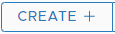

# Adding Adapters

## Why should I add adapters?

Mangle supports most of the endpoints out of the box. However, certain proprietary endpoints such as VMware vCenter require additional dependencies which would consume CPU and memory resources when enabled by default. To make the default deployment of Mangle lightweight, the dependencies required to support VMware vCenter has been externalized and consolidated in a separate container called the vCenter adapter. 

If you require Mangle to run faults against vCenter, then you should deploy an additional container for the vCenter adapter \(refer to the '[**Deploying the Mangle vCenter adapter container section**](../mangle-administration/supported-deployment-models/#deploying-the-mangle-vcenter-adapter-container)**'** under the [**Mangle Deployment and Administration Guide**](../mangle-administration/) ****for details.**\)** and add the adapter instance under Mangle.

## Adapter Types

At present only a single adapter type for vCenter Server is supported. But in future, there are plans to support adapters for other VMware products.

### vCenter Server Adapter

**Steps to follow:** 

1. Login as an user with read and write privileges to Mangle.
2. Navigate to Endpoint tab ---&gt; Adapters ---&gt; vCenter Adapter
3. Click on  . Select the appropriate Endpoint type.
4. Enter a name, IP/Hostname, credentials, vCenter Adapter URL \(format: "_https://&lt;IP/Hostname&gt;:&lt;Port&gt;_"where the IP/hostname is the docker host where the adapter container runs appended with the port used\), username, password, tags \(refers to additional tags that should be send to the enabled metric provider to uniquely identify faults against that endpoint\) and click on **Test Connection**.
5. If **Test Connection** succeeds click on **Submit**.
6. A success message is displayed and the table for Adapters will be updated with the new entry.
7. Edit and Delete operations are supported for all saved adapters.


vCenter adapter if deployed on the same machine on which Mangle is running, vCenter adapter IP used for adding vCenter endpoint can be either

* An internal docker container IP OR
* A docker host IP 

**To find out the internal docker container IP for mangle-vc-adapter run**

`docker inspect --format '{{.NetworkSettings.IPAddress}}' *mangle-vc-adapter`


