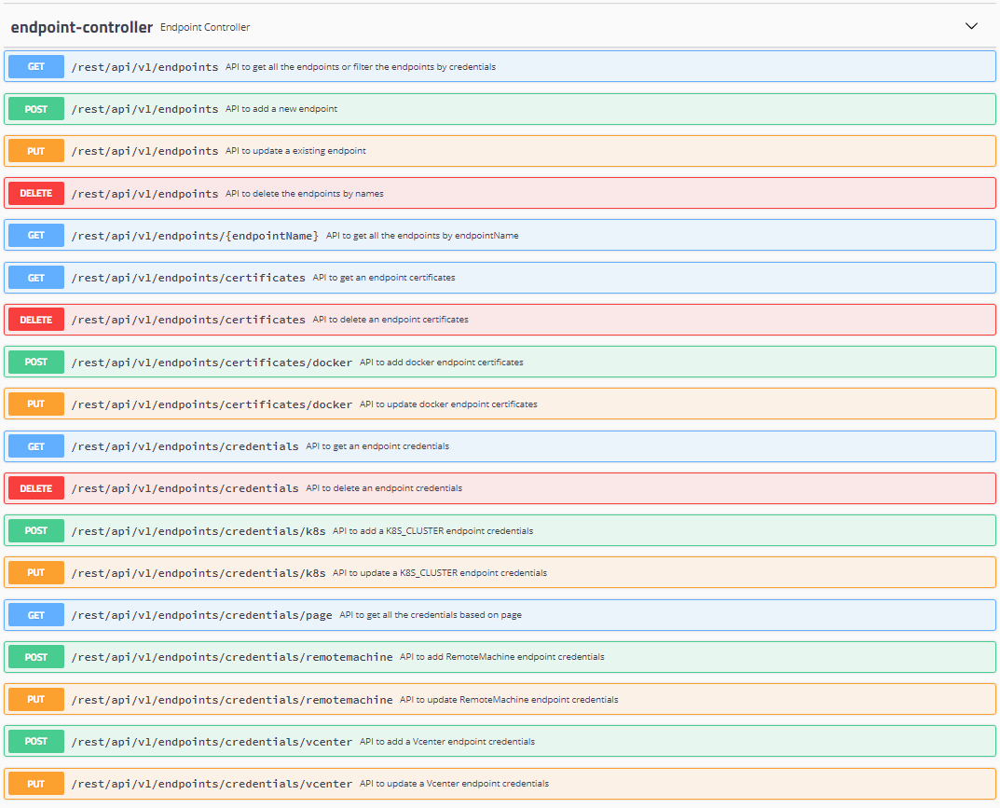

# Adding Endpoints

## Supported Endpoints

Endpoint in Mangle refers to an infrastructure component that will be the primary target for your chaos engineering experiments.

For **version 1.0**, Mangle supported four types of endpoints: 

1. Kubernetes
2. Docker
3. VMware vCenter
4. Remote Machine

From **version 2.0**,  apart from the four endpoints listed above, support has been extended to the following new endpoint:

1. AWS \(Amazon Web Services\)

From **version 3.0**,  support has been extended to the following new endpoints:

1. Azure
2. Databases \(Postgres, Cassandra and Mongo\)

### Kubernetes Endpoint

Mangle supports K8s clusters as endpoints or targets for injection. It needs a kubeconfig file to connect to the cluster and run the supported faults. If a kubeconfig file is not provided, Mangle assumes that it is running on a K8s cluster and targets the same cluster for fault injection.

| Tested Versions of K8s |
| :--- |
| v1.9.6, v1.9.9 |

**Steps to follow:** 

1. Login as an user with read and write privileges to Mangle.
2. Navigate to Endpoint tab ---&gt; Endpoints ---&gt; Kubernetes Cluster.
3. Click on  .
4. Enter a name, credentials, namespace \(mandatory...Please specify "default" if you are unsure of the namespace else provide the actual name\), tags \(refers to additional tags that should be send to the enabled metric provider to uniquely identify faults against that endpoint\) and click on **Test Connection**.
5. If **Test Connection** succeeds click on **Submit**.
6. A success message is displayed and the table for Endpoints will be updated with the new entry.
7. Edit, Delete, Enable and Disable actions are available for all added Endpoints.

### Docker Endpoint

Mangle supports docker hosts as endpoints or targets for injection. It needs the IP/Hostname, port details and certificate details \(if TLS is enabled for the docker host with --tlsverify option specified\) to connect to the docker host and run the supported faults. Please use the Certificates section under Endpoint tab to create a certificate for the Docker endpoint if TLS is enabled.

| Tested Versions of Docker |
| :--- |
| 1.13.1, build 092cba3 |
| 17.06.0-ce, build 02c1d87 |
| 18.09.3, build 774a1f4 |

**Steps to follow:** 

1. Login as an user with read and write privileges to Mangle.
2. Navigate to Endpoint tab ---&gt; Endpoints ---&gt; Docker.
3. Click on .
4. Enter a name, IP/Hostname, port details, tags \(refers to additional tags that should be send to the enabled metric provider to uniquely identify faults against that endpoint\), certificate details \(if TLS is enabled for the docker host\)and click on **Test Connection**.
5. If **Test Connection** succeeds click on **Submit**.
6. A success message is displayed and the table for Endpoints will be updated with the new entry.
7. Edit, Delete, Enable and Disable actions are available for all added Endpoints.

### VMware vCenter Endpoint

Mangle supports VMware vCenter as endpoints or targets for injection. It needs the IP/Hostname, credentials and a vCenter adapter URL to connect to the vCenter instance and run the supported faults.

| Tested and Supported Versions of VMware vCenter |
| :--- |
| vCenter versions 6.5 and above |

**Steps to follow:** 

1. Login as an user with read and write privileges to Mangle.
2. Navigate to Endpoint tab ---&gt; Endpoints ---&gt; VMware vCenter.
3. Click on .
4. Enter a name, IP/Hostname, credentials, vCenter Adapter URL \(format: "_https://&lt;IP/Hostname&gt;:&lt;Port&gt;_"where the IP/hostname is the docker host where the adapter container runs appended with the port used\), username, password, tags \(refers to additional tags that should be send to the enabled metric provider to uniquely identify faults against that endpoint\) and click on **Test Connection**.
5. If **Test Connection** succeeds click on **Submit**.
6. A success message is displayed and the table for Endpoints will be updated with the new entry.
7. Edit, Delete, Enable and Disable actions are available for all added Endpoints.


When the vCenter adapter is deployed on the same machine on which Mangle is running, vCenter adapter IP used for adding vCenter endpoint can be either

* A internal docker container IP OR
* A docker host IP 

**To find out the internal docker container IP for mangle-vc-adapter run**

`docker inspect --format '{{.NetworkSettings.IPAddress}}' *mangle-vc-adapter`


### Remote Machine Endpoint

Mangle supports any remote machine with ssh enabled as endpoints or targets for injection. It needs the IP/Hostname, credentials \(either password or private key\), ssh details, OS type and tags to connect to the remote machine and run the supported faults.

| Tested Versions of Remote Machines with OS type | Versions |
| :--- | :--- |
| CentOS | 7, 7.7, 7.8, 8.2 |
| Debian | 7.8, 8, 9 |
| Photon OS | 1, 2, 3 |
| RHEL | 7.5, 8.2, 8.3 |
| Suse | 12, 15 |
| Ubuntu | 14, 16, 18 |

**Steps to follow:** 

1. Login as an user with read and write privileges to Mangle.
2. Navigate to Endpoint tab ---&gt; Endpoints ---&gt; Remote Machine.
3. Click on .
4. Enter a name, IP/Hostname, credentials \(either password or private key\), ssh port, ssh timeout, OS type, tags \(refers to additional tags that should be send to the enabled metric provider to uniquely identify faults against that endpoint\) and click on **Test Connection**.
5. If **Test Connection** succeeds click on **Submit**.
6. A success message is displayed and the table for Endpoints will be updated with the new entry.
7. Edit, Delete, Enable and Disable actions are available for all added Endpoints.

### AWS \(Amazon Web Services\)

Mangle supports AWS as endpoint or target for injection. It needs the Region, credentials \(Access key ID and Secret key\) and tags to connect to AWS and run the supported faults. Currently the only supported service is EC2. However,  there are plans to extend this to other important services in AWS.

**Steps to follow:** 

1. Login as an user with read and write privileges to Mangle.
2. Navigate to Endpoint tab ---&gt; Endpoints ---&gt; AWS.
3. Click on .
4. Enter a name, Region, credentials \(Access key ID and Secret key\), tags \(refers to additional tags that should be send to the enabled metric provider to uniquely identify faults against that endpoint\) and click on **Test Connection**.
5. If **Test Connection** succeeds click on **Submit**.
6. A success message is displayed and the table for Endpoints will be updated with the new entry.
7. Edit, Delete, Enable and Disable actions are available for all added Endpoints.

###  Azure 

‌Mangle supports Azure as endpoint or target for injection. It needs the Subscription ID, Tenant ID, credentials \(Client application ID and Client application secret key\) and tags to connect to Azure and run the supported faults. ‌

**Steps to follow:**‌

1. Login as an user with read and write privileges to Mangle.
2. Navigate to Endpoint tab ---&gt; Endpoints ---&gt; Azure.
3. Click on .
4. Enter a name, Subscription ID, Tenant ID, credentials \(Client application ID and Client application secret key\) and tags \(refers to additional tags that should be send to the enabled metric provider to uniquely identify faults against that endpoint\) and click on **Test Connection**.
5. If **Test Connection** succeeds click on **Submit**.
6. A success message is displayed and the table for Endpoints will be updated with the new entry.
7. Edit, Delete, Enable and Disable actions are available for all added Endpoints.

###  Redis Proxy 

‌With version 3.0, Mangle provides the ability to run faults against Redis by integrating with [RedFI \(Redis Fault Injection Proxy\)](https://openfip.github.io/redfi/) which is a separate open source project. To try out the Redis faults, it is mandatory that you have a Redis proxy up and running in your environment. To deploy the RedisFI proxy please refer to the instructions specified [here](https://github.com/openfip/redfi#usage). After the proxy is deployed and running, proceed to the steps below to add it as an endpoint in Mangle.

**Steps to follow:**‌

1. Login as an user with read and write privileges to Mangle.
2. Navigate to Endpoint tab ---&gt; Endpoints ---&gt; Redis Proxy.
3. Click on .
4. Enter a name, IP/Hostname of the Redis Proxy, an alternate controller port if it is other than the default one - 6380, tags \(refers to additional tags that should be send to the enabled metric provider to uniquely identify faults against that endpoint\) and click on **Test Connection**.
5. If **Test Connection** succeeds click on **Submit**.
6. A success message is displayed and the table for Endpoints will be updated with the new entry.
7. Edit, Delete, Enable and Disable actions are available for all added Endpoints.

###  Databases 

‌With version 3.0, Mangle provides the ability to run faults against databases. The databases supported are Cassandra, Mongo and Postgres. The database endpoint has one key difference since they can reside on a virtual machine/instance as a service, on Docker as containers or on K8s as pods. Hence, when defining database endpoints in Mangle, you also need to specify the parent endpoint which could be a remote machine, Docker or a K8s cluster.

**Steps to follow:**‌

1. Login as an user with read and write privileges to Mangle.
2. Navigate to Endpoint tab ---&gt; Endpoints ---&gt; Databases.
3. Click on .
4. Enter a name for the database endpoint, database credentials \(Database Type, Database Username and Password, Database Port, Database Name and SSL Enabled status\), the parent endpoint \(which could either be a remote machine, Docker or K8s endpoint already added to Mangle\), tags \(refers to additional tags that should be send to the enabled metric provider to uniquely identify faults against that endpoint\) and click on **Test Connection**.
5. Click on **Submit**.
6. A success message is displayed and the table for Endpoints will be updated with the new entry.
7. Edit, Delete, Enable and Disable actions are available for all added Endpoints.

## Relevant API Reference


**For access to Swagger documentation:**

Please traverse to link **** -----&gt; API Documentation from the Mangle UI or access _https://&lt;Mangle IP or Hostname&gt;/mangle-services/swagger-ui.html\#_/_endpoint-controller_

   


