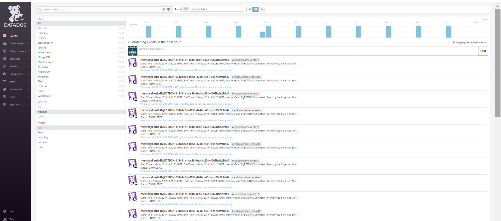
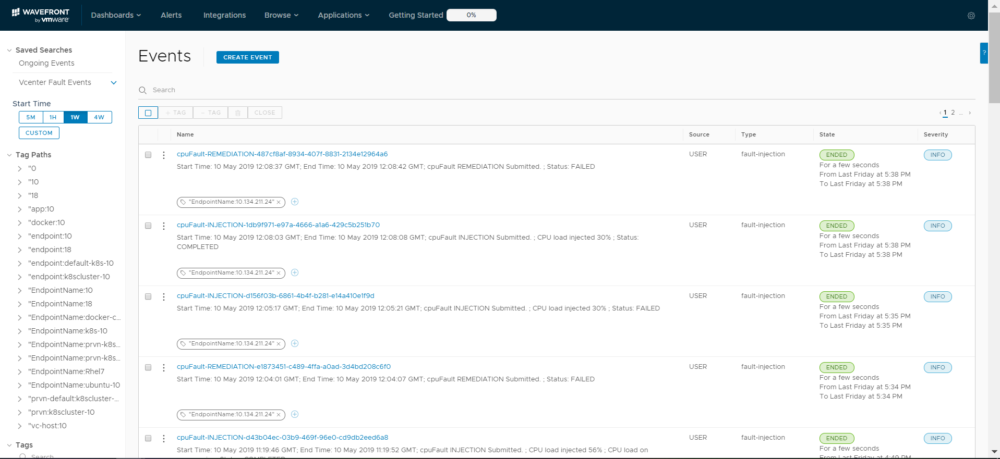
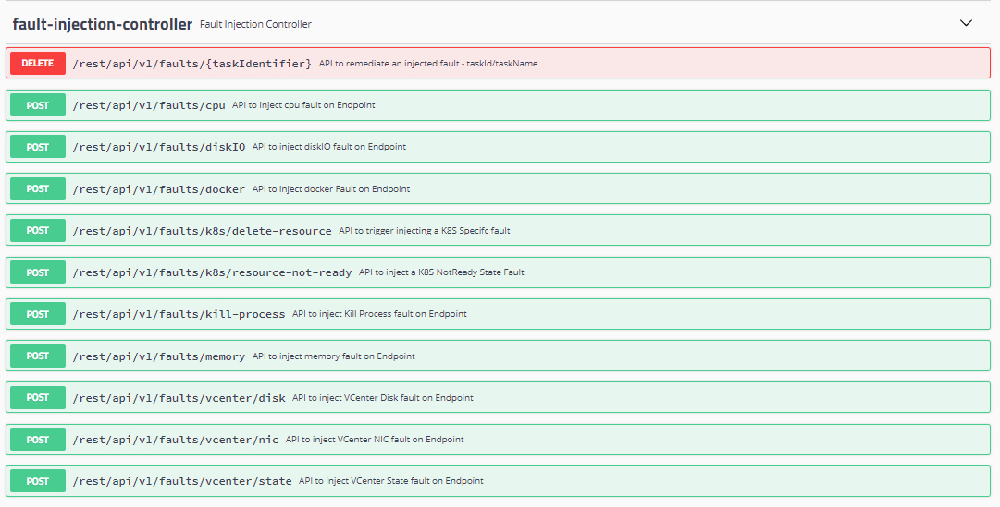

# Application Faults

For **version 1.0**, Mangle supported the following types of application faults: 

1. CPU Fault
2. Memory Fault

From **version 2.0**,  apart from the faults listed above, support has been extended to the following new faults:

1. File Handler Leak Fault
2. Thread Leak Fault
3. Java Method Latency Fault
4. Spring Service Latency Fault
5. Spring Service Exception Fault
6. Simulate Java Exception
7. Kill JVM Fault

## CPU Fault

CPU fault enables spiking cpu usage values for a selected application within a specified endpoint by a percentage specified by the user. Mangle uses a modified Byteman agent to simulate this fault and supports only Java based applications at present. With the help of a timeout field the duration for the fault run can be specified after which Mangle triggers the automatic remediation procedure which includes a cleanup of the Byteman agent from the target endpoint.

This fault therefore takes additional arguments to identify the application under test.

**Steps to follow:** 

1. Login as a user with read and write privileges to Mangle.
2. Navigate to Fault Execution tab ---&gt; Application Faults ---&gt; CPU.
3. Select an Endpoint.

   **If the Endpoint is of type Kubernetes:**

   Provide additional K8s arguments such as Container Name, Pod Labels and the Random Injection flag.

   **If the Endpoint is of type Docker:**

   Provide additional Docker argument such as Container Name.

4. Provide a "CPU Load" value. For eg: 80 to simulate a CPU usage of 80% on the selected application.
5. Provide "Injection Home Dir" only if you would like Mangle to push the script files needed to simulate the fault to a specific location on the endpoint. Else the default temp location will be used.
6. Provide a "Timeout" value in milliseconds. For eg: if you need the CPU load of 80% to be sustained for a duration of 1 hour then you should provide the timeout value as 3600000 \(1 hour = 3600000 ms\). After this duration, Mangle will ensure remediation of the fault without any manual intervention.
7. Provide additional JVM properties such as Java Home, JVM Process, Free Port and Logon User. For eg: If the application under test is a VMware application then the JRE for the application resides in a specific location so for Java Home enter string /usr/java/jre-vmware/bin/java. The JVM Process can be either the process id of the application or the JVM descriptor name. In cases where you schedule, application faults, it is preferable to specify the JVM descriptor name. The Free Port is for the Byteman agent to talk to the application, so provide one that is not in use. The Logon User should be a user who has permissions to access and run the application under test. If it is root specify that else specify the appropriate user id. 
8. Schedule options are required only if the fault needs to be re-executed at regular intervals against an endpoint.
9. Tags are key value pairs that will be send to the active monitoring tool under Mangle Admin settings ---&gt; Metric Providers at the time of publishing events for fault injection and remediation. They are not mandatory.
10. Click on Run Fault.
11. The user will be re-directed to the Processed Requests section under Requests & Reports tab.
12. If Mangle was able to successfully trigger the fault, the status of the task will change to "COMPLETED". The fault will continue to run at the endpoint until the timeout expires or a remediation request is triggered. The option to trigger a remediation request at anytime can be found on clicking the  button against the task in the Processed Requests table.
13. For monitoring purposes, log into either Wavefront or Datadog once it is configured as an active Metric provider in Mangle and refer to the Events section. Events similar to the screenshots provided below will be available on the monitoring tool for tracking purposes.

      

       

## Memory Fault

Memory fault enables spiking memory usage values for a selected endpoint by a percentage specified by the user. With the help of a timeout field the duration for the fault run can be specified after which Mangle triggers the automatic remediation procedure.

**Steps to follow:** 

1. Login as a user with read and write privileges to Mangle.
2. Navigate to Fault Execution tab ---&gt; Infrastructure Faults ---&gt; Memory.
3. Select an Endpoint.

   **If the Endpoint is of type Kubernetes:**

   Provide additional K8s arguments such as Container Name, Pod Labels and the Random Injection flag.

   **If the Endpoint is of type Docker:**

   Provide additional Docker argument such as Container Name.

4. Provide a "Memory Load" value. For eg: 80 to simulate a Memory usage of 80% on the selected Endpoint.
5. Provide "Injection Home Dir" only if you would like Mangle to push the script files needed to simulate the fault to a specific location on the endpoint. Else the default temp location will be used.
6. Provide a "Timeout" value in milliseconds. For eg: if you need the Memory load of 80% to be sustained for a duration of 1 hour then you should provide the timeout value as 3600000 \(1 hour = 3600000 ms\). After this duration, Mangle will ensure remediation of the fault without any manual intervention.
7. Provide additional JVM properties such as Java Home, JVM Process, Free Port and Logon User. For eg: If the application under test is a VMware application then the JRE for the application resides in a specific location so for Java Home enter string /usr/java/jre-vmware/bin/java. The JVM Process can be either the process id of the application or the JVM descriptor name. In cases where you schedule, application faults, it is preferable to specify the JVM descriptor name. The Free Port is for the Byteman agent to talk to the application, so provide one that is not in use. The Logon User should be a user who has permissions to access and run the application under test. If it is root specify that else specify the appropriate user id. 
8. Schedule options are required only if the fault needs to be re-executed at regular intervals against an endpoint.
9. Tags are key value pairs that will be send to the active monitoring tool under Mangle Admin settings ---&gt; Metric Providers at the time of publishing events for fault injection and remediation. They are not mandatory.
10. Click on Run Fault.
11. The user will be re-directed to the Processed Requests section under Requests & Reports tab.
12. If Mangle was able to successfully trigger the fault, the status of the task will change to "COMPLETED". The fault will continue to run at the endpoint until the timeout expires or a remediation request is triggered. The option to trigger a remediation request at anytime can be found on clicking the  button against the task in the Processed Requests table.
13. For monitoring purposes, log into either Wavefront or Datadog once it is configured as an active Metric provider in Mangle and refer to the Events section. Events similar to the screenshots provided below will be available on the monitoring tool for tracking purposes.

      

       

## File Handler Leak Fault

File Handler Leak fault enables you to simulate conditions where a program requests for a handle to a resource but does not release it when the resource is no longer in use. This condition if left over extended periods of time, will lead to "Too many open file handles" errors and will cause performance degradation or crashes. With the help of a timeout field the duration for the fault run can be specified after which Mangle triggers the automatic remediation procedure.

**Steps to follow:** 

1. Login as a user with read and write privileges to Mangle.
2. Navigate to Fault Execution tab ---&gt; Infrastructure Faults ---&gt; Memory.
3. Select an Endpoint.

   **If the Endpoint is of type Kubernetes:**

   Provide additional K8s arguments such as Container Name, Pod Labels and the Random Injection flag.

   **If the Endpoint is of type Docker:**

   Provide additional Docker argument such as Container Name.

4. Provide "Injection Home Dir" only if you would like Mangle to push the script files needed to simulate the fault to a specific location on the endpoint. Else the default temp location will be used.
5. Provide a "Timeout" value in milliseconds. For eg: if you need the File Handler leak to be sustained for a duration of 1 hour then you should provide the timeout value as 3600000 \(1 hour = 3600000 ms\). After this duration, Mangle will ensure remediation of the fault without any manual intervention.
6. Provide additional JVM properties such as Java Home, JVM Process, Free Port and Logon User. For eg: If the application under test is a VMware application then the JRE for the application resides in a specific location so for Java Home enter string /usr/java/jre-vmware/bin/java. The JVM Process can be either the process id of the application or the JVM descriptor name. In cases where you schedule, application faults, it is preferable to specify the JVM descriptor name. The Free Port is for the Byteman agent to talk to the application, so provide one that is not in use. The Logon User should be a user who has permissions to access and run the application under test. If it is root specify that else specify the appropriate user id. 
7. Schedule options are required only if the fault needs to be re-executed at regular intervals against an endpoint.
8. Tags are key value pairs that will be send to the active monitoring tool under Mangle Admin settings ---&gt; Metric Providers at the time of publishing events for fault injection and remediation. They are not mandatory.
9. Click on Run Fault.
10. The user will be re-directed to the Processed Requests section under Requests & Reports tab.
11. If Mangle was able to successfully trigger the fault, the status of the task will change to "COMPLETED". The fault will continue to run at the endpoint until the timeout expires or a remediation request is triggered. The option to trigger a remediation request at anytime can be found on clicking the  button against the task in the Processed Requests table.
12. For monitoring purposes, log into either Wavefront or Datadog once it is configured as an active Metric provider in Mangle and refer to the Events section. Events similar to the screenshots provided below will be available on the monitoring tool for tracking purposes.

      

       

## Thread Leak Fault

Thread Leak fault enables you to simulate conditions where an open thread is not closed. This condition if left over extended periods of time, leads to too many open threads thus creating thread leaks and out of memory issues. Usually a thread dump is required to troubleshoot such issues. With the help of a timeout field the duration for the fault run can be specified after which Mangle triggers the automatic remediation procedure.

**Steps to follow:** 

1. Login as a user with read and write privileges to Mangle.
2. Navigate to Fault Execution tab ---&gt; Infrastructure Faults ---&gt; Memory.
3. Select an Endpoint.

   **If the Endpoint is of type Kubernetes:**

   Provide additional K8s arguments such as Container Name, Pod Labels and the Random Injection flag.

   **If the Endpoint is of type Docker:**

   Provide additional Docker argument such as Container Name.

4. Set of Out of Memory required flag to true if you want the thread leak to eventually result in OOM errors.
5. Provide "Injection Home Dir" only if you would like Mangle to push the script files needed to simulate the fault to a specific location on the endpoint. Else the default temp location will be used.
6. Provide a "Timeout" value in milliseconds. For eg: if you need the Thread leak to be sustained for a duration of 1 hour then you should provide the timeout value as 3600000 \(1 hour = 3600000 ms\). After this duration, Mangle will ensure remediation of the fault without any manual intervention.
7. Provide additional JVM properties such as Java Home, JVM Process, Free Port and Logon User. For eg: If the application under test is a VMware application then the JRE for the application resides in a specific location so for Java Home enter string /usr/java/jre-vmware/bin/java. The JVM Process can be either the process id of the application or the JVM descriptor name. In cases where you schedule, application faults, it is preferable to specify the JVM descriptor name. The Free Port is for the Byteman agent to talk to the application, so provide one that is not in use. The Logon User should be a user who has permissions to access and run the application under test. If it is root specify that else specify the appropriate user id. 
8. Schedule options are required only if the fault needs to be re-executed at regular intervals against an endpoint.
9. Tags are key value pairs that will be send to the active monitoring tool under Mangle Admin settings ---&gt; Metric Providers at the time of publishing events for fault injection and remediation. They are not mandatory.
10. Click on Run Fault.
11. The user will be re-directed to the Processed Requests section under Requests & Reports tab.
12. If Mangle was able to successfully trigger the fault, the status of the task will change to "COMPLETED". The fault will continue to run at the endpoint until the timeout expires or a remediation request is triggered. The option to trigger a remediation request at anytime can be found on clicking the  button against the task in the Processed Requests table.
13. For monitoring purposes, log into either Wavefront or Datadog once it is configured as an active Metric provider in Mangle and refer to the Events section. Events similar to the screenshots provided below will be available on the monitoring tool for tracking purposes.

      

       

## Java Method Latency Fault

Java Method Latency Fault helps you simulate a condition where calls to a specific Java method can be delayed by a specific time. Please note that you would have to be familiar with the application code; Java classes and methods in order to simulate this fault. With the help of a timeout field the duration for the fault run can be specified after which Mangle triggers the automatic remediation procedure.

**Steps to follow:** 

1. Login as a user with read and write privileges to Mangle.
2. Navigate to Fault Execution tab ---&gt; Infrastructure Faults ---&gt; Memory.
3. Select an Endpoint.

   **If the Endpoint is of type Kubernetes:**

   Provide additional K8s arguments such as Container Name, Pod Labels and the Random Injection flag.

   **If the Endpoint is of type Docker:**

   Provide additional Docker argument such as Container Name.

4. Provide "Injection Home Dir" only if you would like Mangle to push the script files needed to simulate the fault to a specific location on the endpoint. Else the default temp location will be used.
5. Provide "Latency" value in milliseconds so that Mangle can delay calls to the method by that time.
6. Provide a "Timeout" value in milliseconds. For eg: if you need the File Handler leak to be sustained for a duration of 1 hour then you should provide the timeout value as 3600000 \(1 hour = 3600000 ms\). After this duration, Mangle will ensure remediation of the fault without any manual intervention.
7. Provide additional JVM properties such as Java Home, JVM Process, Free Port and Logon User. For eg: If the application under test is a VMware application then the JRE for the application resides in a specific location so for Java Home enter string /usr/java/jre-vmware/bin/java. The JVM Process can be either the process id of the application or the JVM descriptor name. In cases where you schedule, application faults, it is preferable to specify the JVM descriptor name. The Free Port is for the Byteman agent to talk to the application, so provide one that is not in use. The Logon User should be a user who has permissions to access and run the application under test. If it is root specify that else specify the appropriate user id. 
8. Schedule options are required only if the fault needs to be re-executed at regular intervals against an endpoint.
9. Tags are key value pairs that will be send to the active monitoring tool under Mangle Admin settings ---&gt; Metric Providers at the time of publishing events for fault injection and remediation. They are not mandatory.
10. Click on Run Fault.
11. The user will be re-directed to the Processed Requests section under Requests & Reports tab.
12. If Mangle was able to successfully trigger the fault, the status of the task will change to "COMPLETED". The fault will continue to run at the endpoint until the timeout expires or a remediation request is triggered. The option to trigger a remediation request at anytime can be found on clicking the  button against the task in the Processed Requests table.
13. For monitoring purposes, log into either Wavefront or Datadog once it is configured as an active Metric provider in Mangle and refer to the Events section. Events similar to the screenshots provided below will be available on the monitoring tool for tracking purposes.

      

       

## Spring Service Latency Fault

File Handler Leak fault enables you to simulate conditions where a program requests for a handle to a resource but does not release it when the resource is no longer in use. This condition if left over extended periods of time, will lead to "Too many open file handles" errors and will cause performance degradation or crashes. With the help of a timeout field the duration for the fault run can be specified after which Mangle triggers the automatic remediation procedure.

**Steps to follow:** 

1. Login as a user with read and write privileges to Mangle.
2. Navigate to Fault Execution tab ---&gt; Infrastructure Faults ---&gt; Memory.
3. Select an Endpoint.

   **If the Endpoint is of type Kubernetes:**

   Provide additional K8s arguments such as Container Name, Pod Labels and the Random Injection flag.

   **If the Endpoint is of type Docker:**

   Provide additional Docker argument such as Container Name.

4. Provide "Injection Home Dir" only if you would like Mangle to push the script files needed to simulate the fault to a specific location on the endpoint. Else the default temp location will be used.
5. Provide a "Timeout" value in milliseconds. For eg: if you need the File Handler leak to be sustained for a duration of 1 hour then you should provide the timeout value as 3600000 \(1 hour = 3600000 ms\). After this duration, Mangle will ensure remediation of the fault without any manual intervention.
6. Provide additional JVM properties such as Java Home, JVM Process, Free Port and Logon User. For eg: If the application under test is a VMware application then the JRE for the application resides in a specific location so for Java Home enter string /usr/java/jre-vmware/bin/java. The JVM Process can be either the process id of the application or the JVM descriptor name. In cases where you schedule, application faults, it is preferable to specify the JVM descriptor name. The Free Port is for the Byteman agent to talk to the application, so provide one that is not in use. The Logon User should be a user who has permissions to access and run the application under test. If it is root specify that else specify the appropriate user id. 
7. Schedule options are required only if the fault needs to be re-executed at regular intervals against an endpoint.
8. Tags are key value pairs that will be send to the active monitoring tool under Mangle Admin settings ---&gt; Metric Providers at the time of publishing events for fault injection and remediation. They are not mandatory.
9. Click on Run Fault.
10. The user will be re-directed to the Processed Requests section under Requests & Reports tab.
11. If Mangle was able to successfully trigger the fault, the status of the task will change to "COMPLETED". The fault will continue to run at the endpoint until the timeout expires or a remediation request is triggered. The option to trigger a remediation request at anytime can be found on clicking the  button against the task in the Processed Requests table.
12. For monitoring purposes, log into either Wavefront or Datadog once it is configured as an active Metric provider in Mangle and refer to the Events section. Events similar to the screenshots provided below will be available on the monitoring tool for tracking purposes.

      

       

## Spring Service Exception Fault

File Handler Leak fault enables you to simulate conditions where a program requests for a handle to a resource but does not release it when the resource is no longer in use. This condition if left over extended periods of time, will lead to "Too many open file handles" errors and will cause performance degradation or crashes. With the help of a timeout field the duration for the fault run can be specified after which Mangle triggers the automatic remediation procedure.

**Steps to follow:** 

1. Login as a user with read and write privileges to Mangle.
2. Navigate to Fault Execution tab ---&gt; Infrastructure Faults ---&gt; Memory.
3. Select an Endpoint.

   **If the Endpoint is of type Kubernetes:**

   Provide additional K8s arguments such as Container Name, Pod Labels and the Random Injection flag.

   **If the Endpoint is of type Docker:**

   Provide additional Docker argument such as Container Name.

4. Provide "Injection Home Dir" only if you would like Mangle to push the script files needed to simulate the fault to a specific location on the endpoint. Else the default temp location will be used.
5. Provide a "Timeout" value in milliseconds. For eg: if you need the File Handler leak to be sustained for a duration of 1 hour then you should provide the timeout value as 3600000 \(1 hour = 3600000 ms\). After this duration, Mangle will ensure remediation of the fault without any manual intervention.
6. Provide additional JVM properties such as Java Home, JVM Process, Free Port and Logon User. For eg: If the application under test is a VMware application then the JRE for the application resides in a specific location so for Java Home enter string /usr/java/jre-vmware/bin/java. The JVM Process can be either the process id of the application or the JVM descriptor name. In cases where you schedule, application faults, it is preferable to specify the JVM descriptor name. The Free Port is for the Byteman agent to talk to the application, so provide one that is not in use. The Logon User should be a user who has permissions to access and run the application under test. If it is root specify that else specify the appropriate user id. 
7. Schedule options are required only if the fault needs to be re-executed at regular intervals against an endpoint.
8. Tags are key value pairs that will be send to the active monitoring tool under Mangle Admin settings ---&gt; Metric Providers at the time of publishing events for fault injection and remediation. They are not mandatory.
9. Click on Run Fault.
10. The user will be re-directed to the Processed Requests section under Requests & Reports tab.
11. If Mangle was able to successfully trigger the fault, the status of the task will change to "COMPLETED". The fault will continue to run at the endpoint until the timeout expires or a remediation request is triggered. The option to trigger a remediation request at anytime can be found on clicking the  button against the task in the Processed Requests table.
12. For monitoring purposes, log into either Wavefront or Datadog once it is configured as an active Metric provider in Mangle and refer to the Events section. Events similar to the screenshots provided below will be available on the monitoring tool for tracking purposes.

      

       

## Simulate Java Exception

File Handler Leak fault enables you to simulate conditions where a program requests for a handle to a resource but does not release it when the resource is no longer in use. This condition if left over extended periods of time, will lead to "Too many open file handles" errors and will cause performance degradation or crashes. With the help of a timeout field the duration for the fault run can be specified after which Mangle triggers the automatic remediation procedure.

**Steps to follow:** 

1. Login as a user with read and write privileges to Mangle.
2. Navigate to Fault Execution tab ---&gt; Infrastructure Faults ---&gt; Memory.
3. Select an Endpoint.

   **If the Endpoint is of type Kubernetes:**

   Provide additional K8s arguments such as Container Name, Pod Labels and the Random Injection flag.

   **If the Endpoint is of type Docker:**

   Provide additional Docker argument such as Container Name.

4. Provide "Injection Home Dir" only if you would like Mangle to push the script files needed to simulate the fault to a specific location on the endpoint. Else the default temp location will be used.
5. Provide a "Timeout" value in milliseconds. For eg: if you need the File Handler leak to be sustained for a duration of 1 hour then you should provide the timeout value as 3600000 \(1 hour = 3600000 ms\). After this duration, Mangle will ensure remediation of the fault without any manual intervention.
6. Provide additional JVM properties such as Java Home, JVM Process, Free Port and Logon User. For eg: If the application under test is a VMware application then the JRE for the application resides in a specific location so for Java Home enter string /usr/java/jre-vmware/bin/java. The JVM Process can be either the process id of the application or the JVM descriptor name. In cases where you schedule, application faults, it is preferable to specify the JVM descriptor name. The Free Port is for the Byteman agent to talk to the application, so provide one that is not in use. The Logon User should be a user who has permissions to access and run the application under test. If it is root specify that else specify the appropriate user id. 
7. Schedule options are required only if the fault needs to be re-executed at regular intervals against an endpoint.
8. Tags are key value pairs that will be send to the active monitoring tool under Mangle Admin settings ---&gt; Metric Providers at the time of publishing events for fault injection and remediation. They are not mandatory.
9. Click on Run Fault.
10. The user will be re-directed to the Processed Requests section under Requests & Reports tab.
11. If Mangle was able to successfully trigger the fault, the status of the task will change to "COMPLETED". The fault will continue to run at the endpoint until the timeout expires or a remediation request is triggered. The option to trigger a remediation request at anytime can be found on clicking the  button against the task in the Processed Requests table.
12. For monitoring purposes, log into either Wavefront or Datadog once it is configured as an active Metric provider in Mangle and refer to the Events section. Events similar to the screenshots provided below will be available on the monitoring tool for tracking purposes.

      

       

## Kill JVM Fault

File Handler Leak fault enables you to simulate conditions where a program requests for a handle to a resource but does not release it when the resource is no longer in use. This condition if left over extended periods of time, will lead to "Too many open file handles" errors and will cause performance degradation or crashes. With the help of a timeout field the duration for the fault run can be specified after which Mangle triggers the automatic remediation procedure.

**Steps to follow:** 

1. Login as a user with read and write privileges to Mangle.
2. Navigate to Fault Execution tab ---&gt; Infrastructure Faults ---&gt; Memory.
3. Select an Endpoint.

   **If the Endpoint is of type Kubernetes:**

   Provide additional K8s arguments such as Container Name, Pod Labels and the Random Injection flag.

   **If the Endpoint is of type Docker:**

   Provide additional Docker argument such as Container Name.

4. Provide "Injection Home Dir" only if you would like Mangle to push the script files needed to simulate the fault to a specific location on the endpoint. Else the default temp location will be used.
5. Provide a "Timeout" value in milliseconds. For eg: if you need the File Handler leak to be sustained for a duration of 1 hour then you should provide the timeout value as 3600000 \(1 hour = 3600000 ms\). After this duration, Mangle will ensure remediation of the fault without any manual intervention.
6. Provide additional JVM properties such as Java Home, JVM Process, Free Port and Logon User. For eg: If the application under test is a VMware application then the JRE for the application resides in a specific location so for Java Home enter string /usr/java/jre-vmware/bin/java. The JVM Process can be either the process id of the application or the JVM descriptor name. In cases where you schedule, application faults, it is preferable to specify the JVM descriptor name. The Free Port is for the Byteman agent to talk to the application, so provide one that is not in use. The Logon User should be a user who has permissions to access and run the application under test. If it is root specify that else specify the appropriate user id. 
7. Schedule options are required only if the fault needs to be re-executed at regular intervals against an endpoint.
8. Tags are key value pairs that will be send to the active monitoring tool under Mangle Admin settings ---&gt; Metric Providers at the time of publishing events for fault injection and remediation. They are not mandatory.
9. Click on Run Fault.
10. The user will be re-directed to the Processed Requests section under Requests & Reports tab.
11. If Mangle was able to successfully trigger the fault, the status of the task will change to "COMPLETED". The fault will continue to run at the endpoint until the timeout expires or a remediation request is triggered. The option to trigger a remediation request at anytime can be found on clicking the  button against the task in the Processed Requests table.
12. For monitoring purposes, log into either Wavefront or Datadog once it is configured as an active Metric provider in Mangle and refer to the Events section. Events similar to the screenshots provided below will be available on the monitoring tool for tracking purposes.

      

       

## Relevant API Reference


**For access to relevant API Swagger documentation:**

Please traverse to link **** -----&gt; API Documentation from the Mangle UI or access _https://&lt;Mangle IP or Hostname&gt;/mangle-services/swagger-ui.html\#_/_fault-injection-controller_

   


