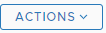

# Redis Faults

With version 3.0, Mangle provides the ability to run faults against Redis by integrating with [RedFI \(Redis Fault Injection Proxy\)](https://openfip.github.io/redfi/) which is a separate open source project. To try out the Redis faults, it is mandatory that you have a Redis proxy up and running in your environment. To deploy the RedisFI proxy please refer to the instructions specified [here](https://github.com/openfip/redfi#usage). After the proxy is deployed and running, follow the instructions under [Adding Endpoints](../adding-endpoints.md#azure-1) to add the Redis FI proxy as an endpoint in Mangle.

From **version 3.0**, Mangle supports the following types of Redis faults: 

1. Delay
2. Return Error
3. Return Empty
4. Drop Connection

##  Delay

Redis Delay fault enables you to simulate scenarios where a specified percentage of Redis transactions respond slow. How slow the transactions need to be can be specified in milliseconds.

**Steps to follow:** 

1. Login as a user with read and write privileges to Mangle.
2. Navigate to Fault Execution tab ---&gt; Database Faults ---&gt; Redis ---&gt; Delay
3. Select a RedisFI Endpoint.
4. Provide a value to indicate what percentage of the Redis transactions would need to be delayed as part of running the fault.
5. Provide a latency value in milliseconds to specify how slow the transactions need to be. The response from Redis will be delayed by this value.
6. Schedule and auto remediation options are _**disabled**_ for Redis because the we have seen cases where the RedisFI proxy does not support such requests at the moment.
7. Tags are key value pairs that will be send to the active monitoring tool under Mangle Admin settings ---&gt; Metric Providers at the time of publishing events for fault injection and remediation. They are not mandatory.
8. Supported notifiers include Slack channels that are configured under Mangle Admin settings ---&gt; Integrations ---&gt; Notifiers. This will enable Mangle to automatically publish status of fault injections to the appropriate Slack channels for monitoring purposes. They are optional and you can choose to exclude this while running faults.
9. Click on Run Fault.
10. The user will be re-directed to the Processed Requests section under Requests & Reports tab.
11. If Mangle was able to successfully trigger the fault, the status of the task will change to "COMPLETED". The option to trigger a remediation request at anytime can be found on clicking the  button against the task in the Processed Requests table.
12. For monitoring purposes, log into either Wavefront or Datadog once it is configured as an active Metric provider in Mangle and refer to the Events section. Events similar to the screenshots provided below will be available on the monitoring tool for tracking purposes.

##  Return Error

Redis Return Error fault enables you to simulate scenarios where a specified percentage of Redis transactions fail to execute or do not complete.

**Steps to follow:** 

1. Login as a user with read and write privileges to Mangle.
2. Navigate to Fault Execution tab ---&gt; Database Faults ---&gt; Redis ---&gt; Return Error
3. Select a RedisFI Endpoint.
4. Provide a value to indicate what percentage of the Redis transactions would need to fail with an error as part of running the fault.
5. Provide a error type so that the transactions can fail with a specific error, i.e either Connection Errors or Execute Errors.
6. Schedule and auto remediation options are _**disabled**_ for Redis because the we have seen cases where the RedisFI proxy does not support such requests at the moment.
7. Tags are key value pairs that will be send to the active monitoring tool under Mangle Admin settings ---&gt; Metric Providers at the time of publishing events for fault injection and remediation. They are not mandatory.
8. Supported notifiers include Slack channels that are configured under Mangle Admin settings ---&gt; Integrations ---&gt; Notifiers. This will enable Mangle to automatically publish status of fault injections to the appropriate Slack channels for monitoring purposes. They are optional and you can choose to exclude this while running faults.
9. Click on Run Fault.
10. The user will be re-directed to the Processed Requests section under Requests & Reports tab.
11. If Mangle was able to successfully trigger the fault, the status of the task will change to "COMPLETED". The option to trigger a remediation request at anytime can be found on clicking the  button against the task in the Processed Requests table.
12. For monitoring purposes, log into either Wavefront or Datadog once it is configured as an active Metric provider in Mangle and refer to the Events section. Events similar to the screenshots provided below will be available on the monitoring tool for tracking purposes.

##  Return Empty

Redis Return Empty fault enables you to simulate scenarios where a specified percentage of Redis transactions return an empty response.

**Steps to follow:** 

1. Login as a user with read and write privileges to Mangle.
2. Navigate to Fault Execution tab ---&gt; Database Faults ---&gt; Redis ---&gt; Return Empty
3. Select a RedisFI Endpoint.
4. Provide a value to indicate what percentage of the Redis transactions would need to return an empty response.
5. Schedule and auto remediation options are _**disabled**_ for Redis because the we have seen cases where the RedisFI proxy does not support such requests at the moment.
6. Tags are key value pairs that will be send to the active monitoring tool under Mangle Admin settings ---&gt; Metric Providers at the time of publishing events for fault injection and remediation. They are not mandatory.
7. Supported notifiers include Slack channels that are configured under Mangle Admin settings ---&gt; Integrations ---&gt; Notifiers. This will enable Mangle to automatically publish status of fault injections to the appropriate Slack channels for monitoring purposes. They are optional and you can choose to exclude this while running faults.
8. Click on Run Fault.
9. The user will be re-directed to the Processed Requests section under Requests & Reports tab.
10. If Mangle was able to successfully trigger the fault, the status of the task will change to "COMPLETED". The option to trigger a remediation request at anytime can be found on clicking the  button against the task in the Processed Requests table.
11. For monitoring purposes, log into either Wavefront or Datadog once it is configured as an active Metric provider in Mangle and refer to the Events section. Events similar to the screenshots provided below will be available on the monitoring tool for tracking purposes.

##  Drop Connection

Redis Drop Connection fault enables you to simulate scenarios where a specified percentage of Redis transactions are dropped due to connection issues.

**Steps to follow:** 

1. Login as a user with read and write privileges to Mangle.
2. Navigate to Fault Execution tab ---&gt; Database Faults ---&gt; Redis ---&gt; Return Empty
3. Select a RedisFI Endpoint.
4. Provide a value to indicate what percentage of the Redis transactions would need to end in drop connection errors.
5. Schedule and auto remediation options are _**disabled**_ for Redis because the we have seen cases where the RedisFI proxy does not support such requests at the moment.
6. Tags are key value pairs that will be send to the active monitoring tool under Mangle Admin settings ---&gt; Metric Providers at the time of publishing events for fault injection and remediation. They are not mandatory.
7. Supported notifiers include Slack channels that are configured under Mangle Admin settings ---&gt; Integrations ---&gt; Notifiers. This will enable Mangle to automatically publish status of fault injections to the appropriate Slack channels for monitoring purposes. They are optional and you can choose to exclude this while running faults.
8. Click on Run Fault.
9. The user will be re-directed to the Processed Requests section under Requests & Reports tab.
10. If Mangle was able to successfully trigger the fault, the status of the task will change to "COMPLETED". The option to trigger a remediation request at anytime can be found on clicking the  button against the task in the Processed Requests table.
11. For monitoring purposes, log into either Wavefront or Datadog once it is configured as an active Metric provider in Mangle and refer to the Events section. Events similar to the screenshots provided below will be available on the monitoring tool for tracking purposes.

