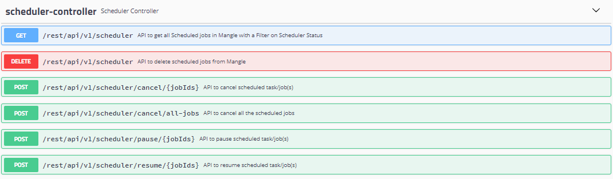

# Requests and Reports

Request & Reports page provides insight to the tasks running during fault execution, fault remediation and triggering of scheduled jobs. Mangle creates tasks that transition to one of the stages : NOT STARTED, IN\_PROGRESS, COMPLETED, FAILED.

## Processed Requests

It provides details of the tasks executed by Mangle.

### Important fields of Mangle tasks

1. Task Name: Name of the task created for any fault execution, remediation or schedule.
2. Status:  Will reflect one of the Stages : NOT STARTED, IN\_PROGRESS, COMPLETED, FAILED.
3. Endpoint Name: Name of the targeted endpoint during fault execution.
4. Task Type: Type of the task executed. For eg: INJECTION or REMEDIATION
5. Task Description: You can get more details about the fault, fault parameters, endpoint targeted, targeted component within an endpoint etc form this field.
6. Start Time: Task trigger time 
7. End Time: Task end time

### Supported operations for Mangle tasks

Click on  to understand what operations are supported for a specific task.

Primarily, the operations supported are Delete, Remediate Fault and Report. 


Remediate Fault option will be enabled only if the the task type is INJECTION and status is set to COMPLETED. 



Delete is not supported for tasks created through scheduled jobs.


### Refreshing the Mangle task data grid

Click on refresh icon   to sync Mangle task data grid with the current status.

## Scheduled Jobs

Scheduled Jobs data grid lists all the schedules available on Mangle.

### Important fields of schedules

1. ID: Contains id of the schedule.
2. Job Type: Type of the schedule. For eg: CRON, SIMPLE
3. Scheduled At: Recurrence and Time at which the schedule will be triggered. If job type is CRON, it shows a cron expression and if the job type is SIMPLE, it shows the epoch time in milliseconds.
4. Status: Status of the schedule. Will reflect one of the values: INITIALIZING, CANCELLED, SCHEDULED, FINISHED, PAUSED, SCHEDULE\_FAILED

### Triggers of each schedule

Click on the ID link of each schedule to view all the triggers of that schedule.

### Supported operations for Mangle schedules

Click on  to understand what operations are supported for a Scheduled Job.

Primarily, the operations supported are Cancel, Pause, Resume, Reports, Delete, and Delete Schedule Only. 

### Refreshing the schedule data grid

Click on refresh icon   to sync Mangle schedule data grid with the current status.

## Logs

Click on the Logs link to open up a browser window displaying the current Mangle application log.

## Relevant API Reference


**For access to relevant API Swagger documentation:**

Please traverse to link **** -----&gt; API Documentation from the Mangle UI or access _https://&lt;Mangle IP or Hostname&gt;/mangle-services/swagger-ui.html\#_/_scheduler-controller_

   


